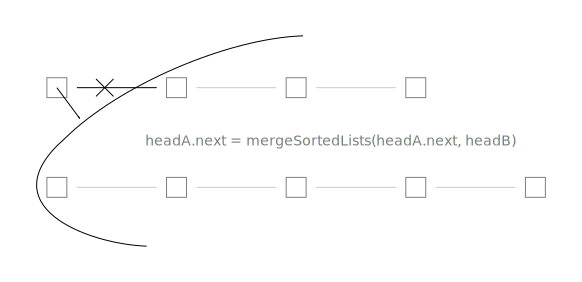
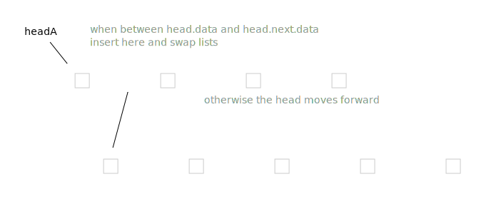
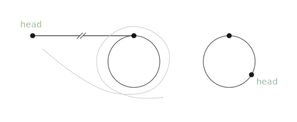
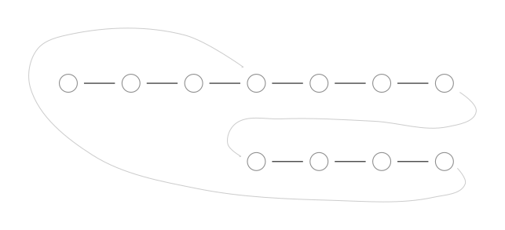
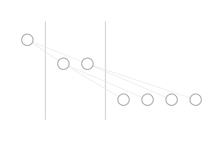
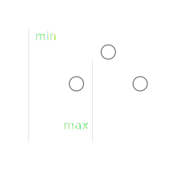


# Contents
{:.no_toc}


* this line is replaced with the generated table of contents
{:toc}

# cracking the coding interview

minimum <http://127.0.0.1:4001/interview_questions/Cracking_the_Coding_Interview.by_Gayle_Laakmann_McDowell.5th.pdf#56>


# Linked lists

``` python
class Node(object):
   def __init__(self, data=None, next_node=None):
       self.data = data
       self.next = next_node
```

``` python
def MergeSortedLists(headA, headB):
    if not headA: return headB
    if not headB: return headA
    
    if headA.data < headB.data:
        headA.next = MergeLists(headA.next, headB)
        return headA
    else:
        headB.next = MergeLists(headA, headB.next)
        return headB
```



``` python
def MergeLists(headA, headB):
    if not headA: return headB
    if not headB: return headA

    if not (headA.data < headB.data):
        headA, headB = headB, headA

    result = headA
        
    while headA.next:
        if headB.data < headA.next.data:
            headA.next, headB = headB, headA.next
        headA = headA.next
 
    headA.next = headB
    return result
```



``` python
# the code assumes the node at position exists
def GetNodeFromEnd(head, position):
    result  = head
    current = head
    i = 0
    
    while current.next:
        i += 1
        current = current.next
        if i > position:
            result = result.next
```

``` python
def RecursiveGetNodeFromEnd(head, position):
    if not head:
        return (None, 0)
    
    (r, i) = RecursiveGetNode(head.next, position)
    if i == position:
        return (head.data, i+1)
    else:
        return (r, i+1)

def GetNodeFromEnd(head, position):
    (r, _) = RecursiveGetNode(head, position)
    return r
```

``` python
def RemoveDuplicates(head):
    if not head:
        return None

    current = head
    
    while current.next:
        if current.data == current.next.data:
            current.next = current.next.next
        else:
            current = current.next
  
    return head
```

detecting a loop in a linked list:
<http://blog.ostermiller.org/find-loop-singly-linked-list>
<http://k2code.blogspot.ru/2010/04/how-would-you-detect-loop-in-linked.html>

``` python
def has_cycle(head):
    if not head or not head.next:
        return False
    
    current = head
    prev = None
    
    while current.next:
        current.next, next, prev = prev, current.next, current
        
    return current is head
```

``` python
def has_cycle(head):
    if not head:
        return False
    
    tortoise = hare = head
    
    while hare.next and hare.next.next:
        tortoise = tortoise.next
        hare = hare.next.next
        if tortoise is hare:
            return True

    return False
```

{: .centered}


{: start="0"}
0. If we put two points on a circle and let them go in one direction, and one of them is twice as fast as the other, they meet again in the starting point after the slower one makes a full turn.
1. Wind the part before the loop to the cycle. Tortoise and hare now meet at the point that corresponts to the head. If we are detecting a cycle, we are done.
2. If we want to find the beginning of the cycle, we put another tortoise at the initial head and let tortoises meet. One will go through the initial part, the other will go through the same part, but wound to the cycle, and they meet at the beginning of the cycle.


``` python
def has_cycle(head):
    if not head:
        return False
    
    tortoise = hare = head
    teleport = 2
    steps = 0
    
    while hare.next:
        steps +=1
        hare = hare.next
        if tortoise is hare:
            return True
        
        if steps == teleport:
            steps = 0
            teleport *= 2
            tortoise = hare

    return False
```

<https://www.hackerrank.com/challenges/find-the-merge-point-of-two-joined-linked-lists>

We can align two linked lists to their ends by skipping some steps on longer list after we know their lengths.
Or we can connect end of one list to beginning of the other and vice versa.
So after traversing of the longer one, we are now syncronized.

{: .centered}



``` python
def FindMergeNode(headA, headB):
    a, b = headA, headB
    while a is not b:
        a = a.next if a.next else headB
        b = b.next if b.next else headA
    return a
```

<https://www.hackerrank.com/challenges/insert-a-node-into-a-sorted-doubly-linked-list>

``` python
def InsertNodeIntoSortedDoublyLinkedList(head, data):
    if not head:
        return Node(data)
    h = head
    while h.next and data > h.next.data:
        h = h.next
    new = Node(data, h.next, h)
    if h.next:
        h.next.prev = new
    h.next = new
    return head
```

<https://www.hackerrank.com/challenges/reverse-a-doubly-linked-list>

``` python
def ReverseDoublyLinkedList(head):
    if not head:
        return head
    head.next, head.prev = head.prev, head.next
    while head.prev:
        head = head.prev
        head.next, head.prev = head.prev, head.next
    return head
```

<div class="ryctoic-questions" markdown="1">
deck:
algorithms and data structures --- linked lists

- q: Write a class for a node of a linked list. --- a: copied from context
- q: Merge two sorted linked lists recursively. --- a: copied from context
- q: Merge two sorted linked lists iteratively. --- a: copied from context
- q: Get nth node from the end of a linked list iteratively. --- a: copied from context
- q: Get nth node from the end of a linked list recursively. --- a: copied from context
- q: Delete duplicates from sorted linked list.
- q: What are the ways to detect a loop in a linked list? --- a: Reverse the list, tortoise and hare, and the optimized version, teleporting tortoise.
- q: Detect a loop in a linked list using reverse.
- q: Detect a loop in a linked list using tortoise and hare algorithm.
- q: Detect a loop in a linked list using teleporting tortoise algorithm.
- q: Find beginning of a loop in a linked list.
- q: Find merge point of two linked lists.
- q: Insert a node into a sorted doubly linked list.
- q: Reverse a doubly linked list.

TODO: 

- q: print elements of a linked list
- q: insert a node at the head of a linked list, return new head
- q: insert a node at the end of a linked list, return the head
- q: insert a node at given position of a linked list, return the head
- q: remove a node at given position of a linked list, return the head
- q: print a linked list in reverse order
- q: compare two linked lists
</div>

TODO: python doesn't have tail recursion. How to work with linked lists? 
TODO: Pollard's rho algorithm for integer factorization. <https://en.wikipedia.org/wiki/Pollard%27s_rho_algorithm>, <https://www.cs.colorado.edu/~srirams/courses/csci2824-spr14/pollardsRho.html> 
TODO: <https://wiki.haskell.org/H-99:_Ninety-Nine_Haskell_Problems>, <http://www.ic.unicamp.br/~meidanis/courses/mc336/2006s2/funcional/L-99_Ninety-Nine_Lisp_Problems.html>, <http://www.informatimago.com/develop/lisp/l99/>


# Trees

<https://www.hackerrank.com/challenges/tree-preorder-traversal>
<https://www.hackerrank.com/challenges/tree-postorder-traversal>
<https://www.hackerrank.com/challenges/tree-inorder-traversal>

TODO: there are two definitions of top view of a tree: a simple one <https://www.hackerrank.com/challenges/tree-top-view>, and a complex one <http://www.geeksforgeeks.org/print-nodes-top-view-binary-tree/>

``` C++
void LevelOrder(node* root)
{
    queue<node*> q;
    q.push(root);
    while( ! q.empty() ) {
        if ( q.front() ) {
            cout << q.front()->data << ' ';
            node* l = q.front()->left;
            node* r = q.front()->right;
            q.push(l);
            q.push(r);
        }
        q.pop();
    }
}
```

{: .centered}


insert data into a binary search tree

``` C++
node * insert_into_bst(node * root, int value) {
    if( !root ) {
        node* r = new node();
        r->data  = value;
        r->left  = NULL;
        r->right = NULL;
        root = r;
    }
    else if(value < root->data) {
      root->left  = insert_into_bst(root->left, value);
    }
    else {
      root->right = insert_into_bst(root->right, value);
    }
    return root;
}
```

``` C++
node* insert(node* root, int value)
{
    node* c = root;
    if( ! root ) {
        node* r = new node();
        r->data = value;
        r->left = NULL;
        r->right = NULL;
        return r;
    }
    while(true) {
        if(value < c->data) {
            if(c->left) {
                c = c->left;
                continue;
            } else{
                node* r = new node();
                r->data = value;
                r->left = NULL;
                r->right = NULL;
                c->left = r;
                break;
            }
        } else {
            if(c->right) {
                c = c->right;
                continue;
            } else{
                node* r = new node();
                r->data = value;
                r->left = NULL;
                r->right = NULL;
                c->right = r;
                break;
            }
        }
    }
    
    return root;
}
```

<https://leetcode.com/problems/validate-binary-search-tree/>

{: .centered}


``` C++
bool check(Node* root, int min, int max) {
    if( !root ) {
        return true;
    }
    if( min < root->data && root->data < max && 
        check(root->left, min, root->data) &&
        check(root->right, root->data, max) ) 
    {
        return true;
    }
    return false;
}

bool checkBST(Node* root) {
    return check(root, INT_MIN, INT_MAX);
}
```

``` C++
node* find_lca(node* root, int v1,int v2)
{
    if(v1 <= root->data && root->data <= v2) {
        return root;
    }
    if(v2 < root->data) {
        return find_lca(root->left, v1, v2);
    }
    if(root->data < v1) {
        return find_lca(root->right, v1, v2);
    }
    return NULL;
}
```

``` C++
void decode_huff(node* root, string s)
{
    node* c = root;
    
    for(std::string::size_type i = 0; i < s.size(); ++i) {
        if(s[i] == '0') {
            c = c->left;
        } else {
            c = c->right;
        }
        if(c->data != '\0') {
            cout << c->data;
            c = root;
            continue;
        }

    }
}
```

<div class="ryctoic-questions" markdown="1">
- q: Print a binary tree preorder traversal --- a: 
- q: Print a binary tree postorder traversal --- a: 
- q: Print a binary tree inorder traversal --- a: 
- q: Get height of a binary tree
- q: Print a binary tree using breadth-first search
- q: Insert a new node into a binary search tree recursively.
- q: Insert a new node into a binary search tree iteratively.
- q: Validate binary search tree.
- q: Find lowest common ancestor of two elements in a binary search tree. --- a: Do not forget to consider a case when an one element is above the another.
- q: Decode a bitstring using a given huffman tree. 
</div>


# Stacks

``` python
# <https://www.hackerrank.com/challenges/maximum-element>
n = int(input())
s = []

for _ in range(n):
    l = list(map(int, input().split()))
    if l[0] == 1:
        m = s[-1][1] if s else l[1]
        m = l[1] if m < l[1] else m
        s.append((l[1], m))
    if l[0] == 2:
        s.pop()
    if l[0] == 3:
        print(s[-1][1])
```

``` Python
def validate_balanced_brackets(s):
    stack = []
    for c in s:
        if c in '{[(':
            stack.append(c)
        else:
            try:
                t = stack.pop()
            except IndexError:
                return False
            if (t == '{' and c == '}') or (t == '[' and c == ']') or (t == '(' and c == ')'):
                continue
            else:
                return False
    if stack:
        return False
    return True
```

- q: Maximum element of a stack.
- q: Validate balanced brackets.
- q: Simplest text editor with undo.

# Trie

derived from the word "re*trie*val" and pronounced as "try" to distinguish from "tree"

keys are words, alphabet of size \\(A\\)
number of words in the trie is \\(N\\)

functions:

- insert a key, value
- retrieve a value by key
- delete a key --- lazy without clean up, eager with clean up

\\(\Theta(l)\\), where \\(l\\) is a word length, search miss \\(O(\log_A{N})\\) --- <http://algs4.cs.princeton.edu/lectures/52Tries.pdf#21>

- get number of keys in trie --- lazy dts, eager with number for the whole trie, very eager with numbers for nodes


- get all words with a prefix
- wildcard match
- longest word, which is a prefix of a given one


when you have anything to do with prefixes, alphabetical ordering
also easy to implement, no hash functions, resizing, rehashing

can be slower and require more space than a hash table, depends on data

number of pointers is between RN and RNw, where w is an average word length

application:

- dictionary kv-storage
- spellchecker, t9, word games
- wildcard searching
- sorting
- ip routing (longest prefix matching)
- full text search
- data compression
- computational biology
- storing and queryng xml

<http://algs4.cs.princeton.edu/52trie/>
<https://leetcode.com/articles/implement-trie-prefix-tree/>
<http://phpir.com/tries-and-wildcards/>
Skiena
<https://en.wikipedia.org/wiki/Trie#As_a_replacement_for_other_data_structures>
https://www.toptal.com/java/the-trie-a-neglected-data-structure#performance-tests

http://algs4.cs.princeton.edu/lectures/52Tries.pdf
http://www.cs.princeton.edu/courses/archive/fall05/cos226/lectures/trie.pdf

exercises:
<https://leetcode.com/problems/implement-trie-prefix-tree/>
<https://www.topcoder.com/community/data-science/data-science-tutorials/using-tries/>
<http://www.spoj.com/problems/PHONELST/>
<https://www.codechef.com/problems/EST>
<https://threads-iiith.quora.com/Tutorial-on-Trie-and-example-problems>
<https://www.hackerrank.com/challenges/contacts>
<https://www.hackerrank.com/challenges/no-prefix-set>


<div class="ryctoic-questions" markdown="1">
- why is it called trie?
- trie vs hash table and other search trees
- functions on trie and their implementations
- implementation of nodes
- time-space complexity
- applications
- what about to have hash tables or other data structures instead of arrays in trie nodes?
</div>


<div class="todo" markdown="1">
- TODO: illustraton of trie nodes implementation: <http://127.0.0.1:4001/algorithms/Algorithms.4th.by_Sedgewick_Wayne.pdf#747>
- TODO: search miss \\(O(\log_{A}{N})\\): <http://127.0.0.1:4001/algorithms/Algorithms.4th.by_Sedgewick_Wayne.pdf#756>
- TODO: space requirements and estimates table: <http://127.0.0.1:4001/algorithms/Algorithms.4th.by_Sedgewick_Wayne.pdf#758>
- TODO: exercises table: <http://127.0.0.1:4001/algorithms/Algorithms.4th.by_Sedgewick_Wayne.pdf#767>
- TODO: add exersices
- TODO: add comparements with other algorithms
- TODO: succinct trie --- <http://stevehanov.ca/blog/index.php?id=120>, [Succinct Trees in Practice](http://epubs.siam.org/doi/abs/10.1137/1.9781611972900.9)
- TODO: what is double-array trie? <https://linux.thai.net/~thep/datrie/datrie.html>
- TODO: directed acyclic word graph (aka dawg)
- TODO: radix tree
- TODO: fix wikipedia article on tries --- wrong complexity or memory
</div>

# Ternary search tree

when nodes have most children pointers used, trie is more space and time efficient than the TST

good for large alphabets, ascii, unicode --- tries won't handle this

TODO: can build balanced TSTs via rotations to achieve \( L + \log N \) worst-case guarantees, but probably not worth the trouble, since they work good even without this --- <http://algs4.cs.princeton.edu/lectures/52Tries.pdf#34>
as fast as hash tables for string keys, space efficient


<div class="ryctoic" markdown="1">
- when trie is more efficient than a tst?
</div>


# Skip list

<https://en.wikipedia.org/wiki/Skip_list>

<https://www.quora.com/Why-arent-skip-lists-used-more-often-instead-of-balanced-trees/answer/Jaap-Weel?srid=Ywn4>

<http://stackoverflow.com/questions/256511/skip-list-vs-binary-tree>

<https://www.cs.auckland.ac.nz/~jmor159/PLDS210/niemann/s_cm2.htm>

<http://blog.memsql.com/the-story-behind-memsqls-skiplist-indexes/>

<http://igoro.com/archive/skip-lists-are-fascinating/>

<http://eternallyconfuzzled.com/tuts/datastructures/jsw_tut_skip.aspx>

<https://www.cs.umd.edu/class/spring2008/cmsc420/L12.SkipLists.pdf>


# misc


how to iterate over a binary tree

b-tree

https://www.quora.com/As-we-start-planning-the-next-edition-of-Introduction-to-Algorithms-CLRS-what-should-we-add-and-what-should-we-remove

dfs with explicit stack --- http://stackoverflow.com/questions/5278580/non-recursive-depth-first-search-algorithm/5278667#5278667

https://en.wikipedia.org/wiki/N-gram

invert binary tree, yes

<http://algs4.cs.princeton.edu/cheatsheet/>, <http://introcs.cs.princeton.edu/java/lectures/>

Алгоритмы и структуры данных в ядре Linux, Chromium --- https://habrahabr.ru/company/wunderfund/blog/277143/

Разбор задач финального раунда RCC 2016 <https://habrahabr.ru/company/mailru/blog/310376/>

quotient filter, bloom filter, <https://en.wikipedia.org/wiki/Quotient_filter>, <https://habrahabr.ru/post/242285/>

# Trash



- {{ member.name }}, https://github.com/{{ member.github }}



{{ asdf.name }}, <https://github.com/{{ asdf.github }}>

| col 3 is      | \\(\Theta(l)\\) | $1600  |
| col 2 is      | centered        | $12    |
| zebra stripes | are neat        | $1     |
{: .mytable}


