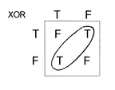

<https://www.reddit.com/r/math/comments/4ieenr/calculus_and_backpropagation/d2xqaj7>

<http://devzum.com/2015/06/best-machine-learning-cheat-sheets/>

<https://s3.amazonaws.com/MLMastery/MachineLearningAlgorithms.png>

<https://github.com/hangtwenty/dive-into-machine-learning>

# misc

examples of statistics using pandas: <https://github.com/rouseguy/intro2stats/tree/master/notebooks>

sort:
<https://codesachin.wordpress.com/2016/06/25/non-mathematical-feature-engineering-techniques-for-data-science/>
<https://www.countbayesie.com/blog/2016/5/1/a-guide-to-bayesian-statistics>

A Visual Introduction to Machine Learning --- <http://www.r2d3.us/visual-intro-to-machine-learning-part-1/>
<https://algobeans.com/>

<https://ml.berkeley.edu/blog/2016/11/06/tutorial-1/>
<https://ml.berkeley.edu/blog/2016/12/24/tutorial-2/>

Computational Statistics in Python 0.1 --- <http://people.duke.edu/~ccc14/sta-663/index.html>

# Kaggle

start with <https://www.quora.com/What-Kaggle-competitions-should-a-beginner-start-with-1/answer/William-Chen-6?srid=Ywn4>

Binary Classification: Titanic: Machine Learning from Disaster

Multi-Class Classification: Forest Cover Type Prediction

Regression with temporal component: Bike Sharing Demand

Binary Classification with text data: Random Acts of Pizza

Digit Recognizer

Amazon Employee Access Challenge

Sentiment Analysis on Movie Reviews

# XGBoost

<https://xgboost.readthedocs.io/en/latest/model.html>

# decision trees

<https://en.wikipedia.org/wiki/C4.5_algorithm> is number one in top ten ml algorithms
<http://scikit-learn.org/stable/modules/tree.html>

tutorials
<http://thegrimmscientist.com/2014/10/23/tutorial-decision-trees/>
<http://people.revoledu.com/kardi/tutorial/DecisionTree/index.html>

## algorithm

we start at the root node

1. find a split that that maximizes information gain
2. do the split
3. recur into two new nodes

stopping rules:

- max depth is reached
- leaf nodes are pure
- splitting doesn't lead to an information gain

## gini vs entropy

> - Gini is intended for continuous attributes, and Entropy for attributes that occur in classes (e.g. colors)
> - “Gini” will tend to find the largest class, and “entropy” tends to find groups of classes that make up ~50% of the data
> - “Gini” to minimize misclassification

from [Theoretical Comparison between the Gini Index and Information Gain Criteria, by Laura E. Raileanu and Kilian Stoffel](http://citeseerx.ist.psu.edu/viewdoc/download?doi=10.1.1.57.9764&rep=rep1&type=pdf):

> [...] we were able to analyze the frequency of agreement/disagremment of the Gini Index function and the Information Gain function. We found that they disagree only in 2%, which explains why most previously published empirical results concluded that it is not possible to decide which one of the two tests to prefer. 

- q: gini vs entropy criterias for decision trees

sources: 
<https://www.garysieling.com/blog/sklearn-gini-vs-entropy-criteria>
<https://sebastianraschka.com/faq/docs/decisiontree-error-vs-entropy.html>
<https://sebastianraschka.com/faq/docs/decision-tree-binary.html>
<http://haohanw.blogspot.ru/2014/08/ml-decision-tree-rule-selection.html>
<https://www.quora.com/What-are-the-advantages-of-different-Decision-Trees-Algorithms>
<https://www.quora.com/Are-gini-index-entropy-or-classification-error-measures-causing-any-difference-on-Decision-Tree-classification>

## entropy

impurity of split

## missing values

# svm

> Why someone would call an algorithm a machine? I have no clue, it was invented by a russian.
> 
> --- Sebastian Thrun, <cite><a href="https://www.youtube.com/watch?v=mzKPXz-Yhwk&index=68&list=PLAwxTw4SYaPkQXg8TkVdIvYv4HfLG7SiH">Intro to Machine Learning</a></cite>
# neural networks

<http://neuralnetworksanddeeplearning.com/>
<http://www.asimovinstitute.org/neural-network-zoo/>
<https://github.com/songrotek/Deep-Learning-Papers-Reading-Roadmap>

<https://www.reddit.com/r/InternetIsBeautiful/comments/4emh2i/play_with_a_neural_network_right_in_your_browser/>

A Few Useful Things to Know about Machine Learning <https://gist.github.com/shagunsodhani/5c2cdfc269bf8aa50b72>, <http://machinelearningmastery.com/useful-things-to-know-about-machine-learning/>

Методы оптимизации нейронных сетей --- <https://habrahabr.ru/post/318970/>

## universal approximation theorem

<http://neuralnetworksanddeeplearning.com/chap4.html>
<https://en.wikipedia.org/wiki/Universal_approximation_theorem>
<http://stackoverflow.com/questions/25609347/can-neural-networks-approximate-any-function-given-enough-hidden-neurons>
<http://cstheory.stackexchange.com/questions/17545/universal-approximation-theorem-neural-networks>
Regarding your example of f(x) = x2, yes you can approximate it with a neural network within any finite range: [-1,1], [0, 1000], etc.
But again, there is no neural network (or any other approximation structure) with a finite number of parameters that can approximate f(x) = x2 for all x in [-∞, +∞].

<https://theneural.wordpress.com/2013/01/07/universal-approximation-and-depth/>
Hidden layer grows $O(e^d)$, where $d$ is dimensionality of input space.

<http://stackoverflow.com/questions/8160183/neural-nets-as-universal-approximators>
the theorem only says that a function can be represented by a neural net. It does not say whether this representation can be learned or that it would be efficient. In fact, for a single-layer net approximating a highly varying function, the size grows exponentially with the function's complexity.

Quite. It's not hard to come up with models or families of functions which share this property.
What matters is not only whether they can learn it but how much data they need to learn it to a given degree of accuracy. This is the kind of question addressed by nonparametric statistics and statistical learning theory.
the Weierstrass approximation theorem states that every continuous function defined on a closed interval [a, b] can be uniformly approximated as closely as desired by a polynomial function.

`max(0, x)` for activation function: <http://stats.stackexchange.com/questions/141960/deep-neural-nets-relus-removing-non-linearity>

TODO: does svm has this property?

## sigmoid vs tanh

<http://stats.stackexchange.com/questions/101560/tanh-activation-function-vs-sigmoid-activation-function>
<http://stats.stackexchange.com/questions/142348/tanh-vs-sigmoid-in-neural-net>
<https://www.quora.com/In-machine-learning-algorithms-why-is-sigmoid-function-used-primarily-and-not-functions-like-tanh-x-In-tanhx-for-eg-seem-to-split-y-axis-evenly-and-flatten-out-fast-as-x-approaches-+-infinity-The-range-being-sigmoid-0-1-and-tanh-x-1-1>

Sign(sum) can be useful as an example of non-linear activation function.

<https://medium.com/@karpathy/yes-you-should-understand-backprop-e2f06eab496b>

## perceptron

A single perceptron can only solve linearly separable problems.
XOR is not one of them.

TODO: my own illustration
From <http://natureofcode.com/book/chapter-10-neural-networks/>:

