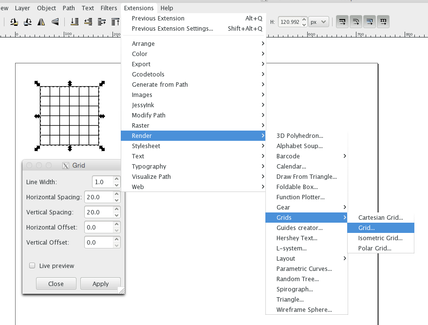

# inkscape

## grid

- q: create a grid 6x6 --- a: create a rectangle 120x120, then `extensions -> render -> grids -> grid`, set `spacing=20`

# command line

less:
`p` --- beginning of file
`G` --- end of file
`/` --- search, `n` and `N` are next and prev

# licenses

<https://www.reddit.com/r/Python/comments/2z4k2q/which_license_you_would_choose_when_you_opensouce/>

# erlang

TODO: Erlang Types Book --- <http://erlang-types-book.com/> --- doesn't work
TODO: <https://github.com/zkessin/testing-erlang-book>
TODO: <https://medium.com/@jlouis666/breaking-erlang-maps-1-31952b8729e6>, <https://medium.com/@jlouis666/breaking-erlang-maps-2-362730a91400>
TODO: <http://blog.listincomprehension.com/2010/03/spoofing-erlang-distribution-protocol.html>

# garbage collector

<https://spin.atomicobject.com/2014/09/03/visualizing-garbage-collection-algorithms/>, <https://github.com/kenfox/gc-viz>

