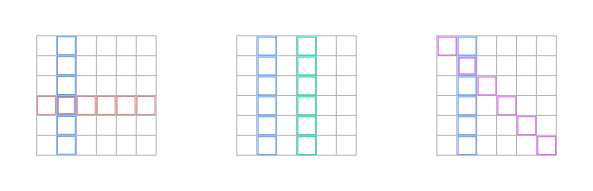

# misc

<http://students.brown.edu/seeing-theory/>

# combinatorics

\\[ \binom{N}{n} \ = \ \frac{N!}{(N-n)! \ n!} \\]

q: number of combinations
q: number of permutations

# axioms

- \\( P(\Omega) = 1 \\)
- \\( P(A) \ge 0 \\)
- \\( P(A+B) = P(A) + P(B) \\)

## sigma-additive measure example

$$
\begin{align*}
P(\{\text{outcome is even}\}) &= P( \{2\} + \{4\} + \{6\} + \ldots) = \\
&= P(\{2\}) + P(\{4\}) + P(\{6\}) + \ldots = \\
&= \frac{1}{2^2} + \frac{1}{2^4} + \frac{1}{2^6} + \ldots = \\ 
&= \frac{1}{4} \cdot (1 + \frac{1}{4} + \frac{1}{4^2} + \frac{1}{4^3} + \ldots) = \\ 
&= \frac{1}{4} \cdot \frac{1}{1-\frac{1}{4}} = \frac{1}{3}
\end{align*}
$$

TODO: more examples

- q: why do we need sigma-additiveness?

## Boole and Bonferroni inequalities

\\( P(A + B) \ \leq \ P(A) + P(B) \\)
\\( P(AB) \ \geq \ P(A) + P(B) - 1 \\)

- q: \\( P(A + B) \ \bigvee \ P(A) + P(B) \\)
- q: \\( P(AB) \ \bigvee \ P(A) + P(B) \\)

TODO: check if there are more under these names

# conditional probability

\\[ P(A \, \| \, B) \ = \ \frac{P(AB)}{P(B)} \\]

<https://en.wikipedia.org/wiki/Penney%27s_game>

Monty Hall problem circle diagram <https://math.ucsd.edu/~crypto/Monty/montybg.html>, <http://blog.room34.com/archives/192>, <https://habrahabr.ru/post/313452/?utm_source=habrahabr&utm_medium=rss&utm_campaign=best>
TODO: conditional
hint: consider 100 doors and after you chose one, you are left with two

# independence

Threre are two equivalent definitions:

\\[ P(A \, \| \, B) \ = \ P(A), \  \text{ when } P(B) \neq 0 \\]

\\[ \text{or} \\]

\\[ P(AB) \ = \ P(A) \cdot P(B) \\]

The first one is more intuitive, the second one doesn't have to have a condition.

Don't confuse independence and disjointness!

{: .centered}

\\[ P( \\{ {\color{#5599ff}\text{first is 2}} \\}, \\{ {\color{#de8787}\text{second is 3}} \\}) \ = \ \frac{1}{16} \ = \ P(\\{ {\color{#5599ff}\text{first is 2}} \\}) \cdot P(\\{ {\color{#de8787}\text{second is 3}} \\}) \\]

\\[ P( \\{ {\color{#5599ff}\text{first is 2}} \\}, \\{ {\color{#00daae}\text{first is 4}} \\}) \ = 0 \ \neq \ P(\\{ {\color{#5599ff}\text{first is 2}} \\}) \cdot P(\\{ {\color{#00daae}\text{first is 4}} \\}) \\]

\\[ P( \\{ {\color{#5599ff}\text{first is 2}} \\}, \\{ {\color{#dd55ff}\text{sum is 7}} \\}) \ = \ \frac{1}{16} \ = \ P(\\{ {\color{#5599ff}\text{first is 2}} \\}) \cdot P(\\{ {\color{#dd55ff}\text{sum is 7}} \\})\\]

## conditional independence

\\[ P(AB \, \| \, C) \ = \ P(A \, \| \, C) \cdot P(B \, \| \, C) \\]

Independence doesn't imply conditional independence.

Here \\( P(AB) = P(A) \cdot P(B) \\), but \\( P(AB \, \| \, C) = 0 \neq P(A \, \| \, C) \cdot P(B \, \| \, C) \\):

{: .centered}

\\[ P \left( \\{ {\color{#5599ff}\text{first is 2}} \\} \\{ {\color{#de8787}\text{second is 3}} \\} \ \middle\vert \ \\{ {\color{#dd55ff}\text{sum is 7}} \\} \right) \ = 0 \ \neq \ \frac{1}{16} \ = \ P(\\{ {\color{#5599ff}\text{first is 2}} \ \| \ \\{ {\color{#dd55ff}\text{sum is 7}} \\}) \cdot P(\\{ {\color{#de8787}\text{second is 3}} \ \| \ \\{ {\color{#dd55ff}\text{sum is 7}} \\}) \\]

Example of _independent_, but _not conditionally independent_. Flipping two coins. \\( A = \\{ \text{1st heads} \\} \\), \\( B = \\{ \text{2nd heads} \\} \\), \\( C = \\{ \text{both are same} \\} \\). \\( A, \ B \\) are independent, but not conditionally independent

Example of _not independent_, but _conditionally independent_. There are two coins: a fair and one with heads on both sides. \\( A = \\{ \text{1st heads} \\} \\), \\( B = \\{ \text{2nd heads} \\} \\), \\( C = \\{ \text{the coin is fair} \\} \\)

{: .centered}

- q: Definition of independence. --- a: \\( P(A \, \| \, B) \ = \ P(A) \text{, when } P(B) \neq 0 \\), or equivalent one, \\( P(AB) \ = \ P(A) \cdot P(B) \\)
- q: Independence vs disjointness.
- q: An example of _independent_, but _not conditionally independent_ events.
- q: An example of _not independent_, but _conditionally independent_ events.

# distributions eli5

from <https://www.reddit.com/r/AskStatistics/comments/52vt7n/this_is_the_best_explanation_of_distributions_ive/d7o64th>:

> (Binomial) The binomial answers the question "if I flip a coin n times, how many times will I get a heads?" It models any sort of yes-no counting process.
> (Negative Binomial) The negative binomial is the opposite of the binomial. It answers the question, "how many coin flips will it take for me to get x heads?"
> (Geometric) The geometric distribution answers the question "How many times do I have to flip a coin until the first heads/tails appears?" or "How many times do I have to throw a die until the first '6' appears?"
> (Poisson) The poisson is the answer to the question "if people arrive at my store once every 5 minutes, how many people can I expect in x minutes?" It models how many events happen in a given time interval.
> (Uniform) The uniform distribution is the answer to the question "If I spin an arrow at the center of a circle of circumference 1, how likely is it that it falls into an arc of a specific length?"
> (Normal) The Normal distribution could be considered as the approximate answer to the question "If a lot small random lengths (which we have some information about) are added together, what is the chance the total length is between these two numbers?"
> (Triangular) The Triangular distribution could be considered a simple best guess distribution, that is, "If all I know are the maximum, minimum and most likely value, what should I use as my distribution? A triangle."
> (Exponential) The exponential is the opposite of the Poisson: "if people arrive once every 5 minutes, then what is the expected amount of time between arrivals?"
> (Gamma) The gamma is related to the exponential, and is the answer to the question: "If people arrive once every 5 minutes, then how long do I have to wait for a specific number of people to arrive".
> (Weibull) The Weibull distribution is the answer to the question: "If I have a machine that crushes rocks into sand, what proportion of grains will be with-in this specific size range?"

<https://habrahabr.ru/post/311092/>

