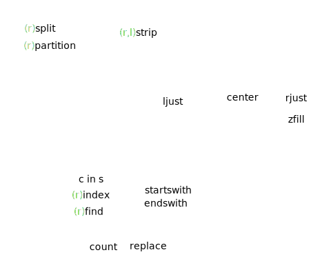

* this line gets replaced with the generated table of contents
{:toc}


?????????????????????????? sum  ???


# true, false, and comparisons




``` python
if () or [] or {} or None:
    'this line is skipped'
```
<https://docs.python.org/3/library/stdtypes.html#truth-value-testing>


<br/>

The interesting thing in python: `b == not a` is a syntax error.
`not` has a lower priority than non-boolean operators, so `not a == b` is interpreted as `not (a == b)`, and `b == not a` is a syntax error.
<https://docs.python.org/3/library/stdtypes.html#boolean-operations-and-or-not>

<br/>

as always, `and` and `or` are short-circuit operators, second argument is not evaluated here:

``` python
if False and whatever():
    'this line is skipped, whatever() is not evaluated'
```

<br/>

`x < y <= z` is equivalent to `x < y and y <= z`, except `y` is evaluated only once
in both cases `z` is not evaluated at all when `x < y` is found to be false

<br/>

comparison operators look quite standard: `==`, `!=`, `<`, `>`, `<=`, `>=`
and for object identity: `is`, `is not`
objects of different _built-in_ types never compare equal (except different numeric types), but we can define an object with `__eq__` --- <http://stackoverflow.com/questions/12379840/python-comparison-between-built-in-and-user-defined-types>
`<`, `>`, `<=`, `>=` raise `TypeError` exception when the objects are of different types that cannot be compared, or in other cases where there is no defined ordering

``` python
>>> 'abc' > 1000
TypeError: unorderable types: str() > int()
```

behavior of the `is` and `is not` operators cannot be customized; also they can be applied to any two objects and never raise an exception

<https://docs.python.org/3/library/stdtypes.html#comparisons>

<br/>

generally you only want to be using `is` with mutable objects (or None, which is the exception)
`x is None` vs `x == None`: [PEP 8](https://www.python.org/dev/peps/pep-0008/#programming-recommendations)
> Comparisons to singletons like None should always be done with is or is not , never the equality operators. 


<http://stackoverflow.com/questions/9494404/use-of-true-false-and-none-as-return-values-in-python-functions>


``` Python
class A(object):
    def __eq__(self, other):
        print( "A __eq__ called: %r == %r ?" % (self, other) )
        return self.value == other.value
class B(object):
    def __eq__(self, other):
        print( "B __eq__ called: %r == %r ?" % (self, other) )
        return self.value == other.value

a = A()
a.value = 3
b = B()
b.value = 4
a == b
```


<div class="ryctoic-questions" markdown="1">
deck:
python --- true, false, and comparisons

TODO:

- q: `==` vs `__eq__()` --- a:
- q: Why `__eq__()` returns `NotImplemented`? --- a: 
- q: What happens when you compare incomparable types?

<https://docs.python.org/3/reference/datamodel.html#object.__eq__>

<https://docs.python.org/3/library/constants.html#NotImplemented>

<https://docs.python.org/3/whatsnew/3.0.html#ordering-comparisons>

- q: What values are considered false in python? --- a: `False`, `None`, any numeric zero, empty sequence, empty dict, instance with `__bool__()` returning False or `__len__()` returning zero
- q: `not a == b` vs `not (a == b)` vs `b == not a` --- a: `not` has a lower priority than non-boolean operators, so `not a == b` is interpreted as `not (a == b)`, and `b == not a` is a syntax error
- q: short-circuiting behavior of boolean operators --- a: `if False and whatever(): 'this line is skipped, whatever() is not evaluated'`
- q: `x < y <= z` vs `x < y and y <= z` --- a: `x < y <= z` is equivalent to `x < y and y <= z`, except `y` is evaluated only once, and in both cases `z` is not evaluated at all when `x < y` is found to be false
- q: What are equal and not equal operators? --- a: `==`, `!=`, the `<>` was removed
- q: What are less, more, less or equal, more or equal operators? --- a: `<`, `>`, `<=`, `>=`
- q: How to test for object identity? --- a: `is`, `is not`
- q: How to customize behavior of `is` and `is not`? --- a: Behavior of the `is` and `is not` operators cannot be customized.
- q: What objects can be tested for identity with the `is` ans `is not` operators? --- a: The `is` and `is not` operators can be applied to any two objects and never raise an exception.
- q: When does the `is` operator throw an exception? --- a: The `is` and `is not` operators can be applied to any two objects and never raise an exception.
- q: `if x` vs `if x == True` vs `if x is True` --- a: Use `if x`; and in extremely rare cases when you really want to explicitly distinguish if `x` is, for example, not `1`, not `[]`, but boolean `True`, check it with `x == True and type(x) is bool`; don't use `x is True`, it will fail in some obscure cases, because `bool` is subclass of `int`.
- q: `if not x` vs `x is None` vs `x == None` --- a: Use the `if not x`; and in cases when you really want to explicitly distinguish `None` and other false values, use `x is None`; don't use `x == None`, because PEP 8.
- q: `x is y` vs `id(x) == id(y)` --- a: Use the former. Don't use `id(x) == id(y)`, because id of an object in CPython being the location in memory is an implementation detail, this may change.
- q: When two objects of different _built-in_ types compare equal? --- a: Objects of different _built-in_ types, except different numeric types, never compare equal.
- q: What happens when you compare objects of different _built-in_ types, e.g, `'a' == 1` and `'abc' > 10`? a: Except for numeric types, `==` and `!=` always return `False` for objects of different _build-in_ types, `<`, `>`, `<=`, `>=` raise `TypeError` exception.
- q: What happens when you sort a heterogeneous list? --- a: All the elements must be comparable to each other, otherwise the `TypeError` is thrown. If `.sort()` is used for in-place sorting, then the list is modified until the occurrence of the error.
</div>

<br />
<br />

# functions


<div class="ryctoic-questions" markdown="1">
- q: Define a function. --- a: `def whatever(): ...`
- q: Define a function with an optional argument. --- a: `def whatever(data=0): ...`
- q: Define a function with a docstring. --- a: An example: 

      def whatever():
          """This is a docstring."""
          pass

- q: Get the docstring of a function? --- a: `help(a_func)` or `a_func.__doc__`
- q: Define a function with a keyword-only arguments. --- a: `def foo(*, arg1=10, arg2=20): ...`
- q: Define a function with an arbitraty argument list. --- a: `def concat(*args, sep="/"): return sep.join(args)`
- q: Define a function with keyword arguments. --- a: `def foo(**kwargs): print(kwargs)`, then call it like this: `foo(a=1, b=2)`, this will print `{'a': 1, 'b': 2}`
- q: Pass a list of arguments to a function with an arbitrary argument list. --- a: Given a function `def foo(*args): ...`, unpack the list `foo(*lst)`
- q: Pass a dictionary of arguments to a function with keyword arguments. --- a: Given a function `def foo(**kwargs): ...`, unpack the dict `foo(**dct)`
- q: Define a function with function annotations. --- a: `def a_func(a_dict: '{str: int}') -> '[str]': print(a_func.__annotations__); ...`
- q: Write a lambda function. --- a: `f = lambda x: x**2`
</div>

TODO: mutable default args, and make sure you use immutable types to catch this earlier
TODO: new type hinting
TODO: function annotations: <https://github.com/kennknowles/python-rightarrow>


# conditionals and loops

``` python
if False:
    whatever()
else:
    print('ok')
```

`switch/case` [pep-3103](https://www.python.org/dev/peps/pep-3103/)

``` python
{
    'a': 1,
    'b': 2,
    'c': 3,
}.get(x, 0)
```

these do not support fall through, and this can be good or bad, depends on the point of view and problems you solve


`range()` used to be `xrange()` in python 2

``` python
for n in range(0,100000000):
  pass

int i = 0
while i < 100000000:
  i += 1
```

<http://stackoverflow.com/questions/869229/why-is-looping-over-range-in-python-faster-than-using-a-while-loop>

``` Python
if condition:
    ...
else:
    ...
```

TODO: what if we do `for i in range(0)`?
TODO: what if we do `for i in ...: else: ... use i`?


<div class="ryctoic-questions" markdown="1">
- q: Write an if-then-else.
- q: Write an one line if-else statement (ternary conditional operator). --- a: `x = 'good' if y else 'bad'`
- q: What is short for else if? --- a: `elif`
- q: What is going to be printed in this example when the condition is false? `if x < y < z: print(x); print(y); print(z)` --- a: Semicolon binds tighter than the colon in this context, so that in this example, either all or none of the print() calls are executed.
- q: Write a switch/case statement. --- a: Python doesn't have this, but we can have an if/elif chain or dict-based dispatch, but those do not support fall through.
- q: `range()` vs `xrange()` --- a: `range()` used to be `xrange()` in python 2.
- q: Write a for loop from 0 to n-1 inclusive. --- a: `for i in range(n): ...`
- q: Write a for loop from 1 to n inclusive. --- a: `for i in range(1, n+1): ...`
- q: What is going to be printed? `for i in range(1, n+1): print(i)` --- a: Numbers from `1` to `n` inclusive.

- q: Get a range with a step --- a: `range(start, end, step)`

- q: Get a range going backwards. --- a: `range(99, 0, -1)`
- q: Get a range from `99` to `0` with a step `2`. --- a: `range(99, 0, -2)`
- q: Get a range from `0` to `-10`. --- a: `range(0, -10, -1)`
- q: `for i in range(10**10): ...` vs `i=0; while i < 10**10: i+=1; ...;`? --- a: The former should be faster, code for `range()` is optimized.
- q: Write a while statement. --- a: `while condition: ...`
- q: What does `else` do after `for` and `while` statements? --- a: The `else` code is executed after the loop ends if there was no `break`.
- q: What are `break` and `continue` for? --- a: `continue` is for moving forward to the next iteration, `break` is for ending the loop.
</div>

# comprehensions

``` python
[(x,y) for x in range(2) for y in range(3)]
```

- q: Write multidimensional list comprehension. --- a: `[ (x,y) for x in ... for y in ... if x>1 if y>1 ]`
- q: Write a list comprehension to get squares of odd numbers from 1 to 8. --- a: `[x**2 for x in range(1, 9) if x%2==1]`
- q: Write a dictionary comprehension. --- a: `l = [1, 1, 2, 3]; d = { x : l.count(x)   for x in l}`; for this particular example there is `collections.Counter(l)` though.
- q: Write a set comprehension. --- a: `set_of_primes = { i for i in range(101) if is_prime(i) }`
- q: Check if any element in a list satisfies some condition. --- a: `any(l == 'x' for l in a_string)`
- q: Check if all elements in a list satisfy some condition. --- a: `all(x > 0 for x in lst)`


# exceptions


``` Python
# http://stackoverflow.com/questions/1611561/can-i-get-the-exception-from-the-finally-block-in-python/1611572#1611572
try:
    whatever
except:
    here sys.exc_info is valid
    to re-raise the exception, use a bare `raise`
else:
    here you know there was no exception
finally:
    and here you can do exception-independent finalization
```


``` Python
# The exception variable is excplicitly deleted after the except block is left.

except E as N:
    foo

# equivalent 

except E as N:
    try:
        foo
    finally:
        del N
```

Exception objects now store their traceback as the `__traceback__` attribute. This means that an exception object now contains all the information pertaining to an exception, and there are fewer reasons to use `sys.exc_info()` (though the latter is not removed).

``` Python
# http://stackoverflow.com/questions/3702675/how-to-print-the-full-traceback-without-halting-the-program/16946886#16946886
import traceback

try:
    raise TypeError("Oups!")
except Exception as err:
    try:
        raise TypeError("Again !?!")
    except:
        pass

    # traceback.print_tb(err.__traceback__)
    traceback.print_exc()

 ### File "e3.py", line 4, in <module>
 ###    raise TypeError("Oups!")
```

``` Python
def func1():
    try:
        return 1
    finally:
        return 2

def func2():
    try:
        raise ValueError()
    except:
        return 1
    finally:
        return 3

func1()   # returns 2
func2()   # returns 3
```

``` Shell
>>> try:
...     print(1 / 0)
... except Exception as exc:
...     raise RuntimeError("Something bad happened") from exc
...
Traceback (most recent call last):
  File "<stdin>", line 2, in <module>
ZeroDivisionError: int division or modulo by zero

The above exception was the direct cause of the following exception:

Traceback (most recent call last):
  File "<stdin>", line 4, in <module>
RuntimeError: Something bad happened
```

``` Python
try:
    self.file = open(filename)
except IOError as e:
    raise DatabaseError('failed to open') from e
```

``` Python
class MyError(Exception):
    """Raise for my specific kind of exception"""
```

``` Python
class Error():
    pass

class InputError(Error):
    def __init__(self, message, expression):
        self.message = message
        self.expression = expression
```

``` Python
def KelvinToFahrenheit(Temperature):
    assert (Temperature >= 0),"Colder than absolute zero!"
    return ((Temperature-273)*1.8)+32
```


``` python
from contextlib import suppress
import os
with suppress(FileNotFoundError):
    print(1')
    os.remove('1.tmp')
    os.remove('2.tmp')
    print(2')
```

<https://docs.python.org/3/tutorial/errors.html#user-defined-exceptions>
<https://www.python.org/dev/peps/pep-0352/>
<https://hg.python.org/cpython/file/3.5/Objects/exceptions.c#l24>
<https://bugs.python.org/issue1692335>

TODO: - q: Write a custom exception class with a value besides message in a portable manner: <http://stackoverflow.com/questions/1319615/proper-way-to-declare-custom-exceptions-in-modern-python> 


TODO: with statement, contextlib
TODO: with pytest.raises(ExpectedException) <http://doc.pytest.org/en/latest/assert.html>
TODO: more from <https://docs.python.org/3/library/traceback.html>

TODO: <https://docs.python.org/3/library/exceptions.html#exception-hierarchy>

<div class="ryctoic-questions" markdown="1">
- q: Write a new exception class. --- a: `class SomeError(Exception): pass` --- but generally it's a good idea to look for an appropriate existing exception first. See python exception hierarchy.
- q: Write a custom exception class with a value besides message. --- a: If you do not need portability, you can write the exception class with `__init__(self, message, value)` that just sets these fields and do not run the `super().__init__()`, because `self.args = args` is already set in `super().__new__()`, this is done for historical reasons.
- q: `Exception` vs `BaseException` as a base class of a custom exception. --- a: The latter should only be used as a base class for exceptions that should only be handled at the top level, such as `SystemExit` or `KeyboardInterrupt`. The recommended idiom for handling all exceptions except for this latter category is to use `except Exception:`. Catching `BaseException` will break `ctrl-c`.
- q: How to raise an exception? --- a: `raise ValueError('Some message')`; raise exception as specific to the problem as possible, don't `raise Exception('message')`, as catching it will also catch any other more specific ones.
- q: Raise an exception with an argument besides the message. --- a: `ValueError('message', 99).args(1) == 99` or, when using a custom exception class, `CustomError('message', 99).custom_field == 99`
- q: How to re-raise the same exception in an except block? --- a: Just `raise` without arguments. Don't do `except ValueError: ... raise ValueError` as you will lose the stack trace.
- q: Naming convention for exception classes. a: From [PEP 8](https://www.python.org/dev/peps/pep-0008/#exception-names): "Because exceptions should be classes, the class naming convention applies here. However, you should use the suffix "Error" on your exception names (if the exception actually is an error). ... Class names should normally use the CapWords convention.". `BeerNotFound` is probably even better then `BeerError`. But again, you could use already existing `LookupError`.
- q: Catch an exception. --- a: `except ValueError as e: ...`
- q: Catch multiple exceptions in one except block. --- a: `except (IDontLIkeYouException, YouAreBeingMeanException) as e: ...`
- q: Catch different exceptions in different except blocks. --- a: `except ValueError: ... except LookupError: ...`
- q: How to catch all existing exceptions and just ignore them? --- a: Just `except:`, but never do this.
- q: How to ignore an exception? Like ignoring file existance before removing it. --- a: `except FileNotFoundError: pass` or `with contextlib.suppress(FileNotFoundError): os.remove('somefile.tmp')` --- it is equivalent to catching and doing `pass` though, this is purely for readability: if we have an exception in a middle of a block, like in `f()` when `z = f(x) * g(y)`, we can't just move on ignoring it.
- q: What is a problem with this: `with suppress(FileNotFoundError): os.remove(1.tmp'); os.remove(2.tmp')`? -- a: The second file won't be deleted if the first `remove` throws the exception. Use the `with suppress()` carefully.
- q: What is `else` in try-catch for? --- a: Think of it as a part of `try` block which is not interested in catching exceptions. When there are no exceptions, `try` and `else` blocks are run together, but when exceptions are raised, after that only `catch` and `finally` blocks are executed.
- q: What is `finally` for? --- a: When an exception has occurred in the try clause and has not been handled by an except clause (or it has occurred in an except or else clause), it is re-raised after the `finally` clause has been executed.
- q: What if we have `return` in both `try/catch` and `finally` blocks? --- a: `finally` block is guaranteed to be executed, so if we have `return` in both `try/except` and `finally` blocks, only the one in latter is run.
- q: How to get exception info in the finally block? --- a: Please don't handle anything in the finally block. It is for exception-independent finalization. Also the exception variable is excplicitly deleted after the except block is left, and exception info is unavailable through it.
- q: What is `assert` for? --- a: Asserts should be used to test conditions that should never happen. The purpose is to crash early in the case of a corrupt program state. They add a tiny overhead, but before making a program fast we have to make it work first. And we can turn asserts off when needed with `-O` flag.
- q: What does `assert` do? --- a: `assert cond, message` is roughly equivalent to `if __debug__ and not cond: raise AssertionError(message)`
- q: What happens here? `assert( 2+2==5, 'Houston, we have a problem' )` --- a: `assert`, unlike `print`, which is a function, is still a statement, so this is equivalent to `assert True`, because syntactically we have a non-empty tuple here. Good news is python and lint gives you warning for this.
- q: Exception chaining. --- a: `except ValueException as exc: raise RuntimeError("Something bad happened") from exc` --- this will give a nice trace back which mentions that `ValueException` is a direct cause of the `RuntimeError("Something bad happened")`. And we have `exc.__cause__`.
- q: What are `exception.__context__` and `exception.__cause__`? --- a: When raising (or re-raising) an exception in an `except` or `finally` clause `__context__` is automatically set to the last exception caught. `raise new_exc from original_exc` sets `new_exc.__cause__`.
- q: How to print traceback of an exception? --- a: In the except block: `traceback.print_exc()`
- q: How to log traceback of an exception? --- a: Use `traceback.format_exc()` and your favorite logger.
</div>


# input

`input()` used to be `raw_input()` in python 2

<http://www.diveintopython3.net/porting-code-to-python-3-with-2to3.html#raw_input>

``` python
int( input().strip() )
```

<div class="ryctoic-questions" markdown="1">
- q: `input()` vs `raw_input()` --- a: `input()` used to be called `raw_input()` in python 2.
- q: Get a string from input. --- a: `resp = input()`
- q: Get a string from input with a prompt, e.g., "please enter your name". --- a: `resp = input('please enter your name: ')`
- q: Get an integer from input. --- a: `int(input())`
- q: Get a list of integers from input in a single line, e.g., `1 2 3 4`. --- a: `list(map(int, input().split()))`
</div>


# slicing

``` python
a = [0, 1, 2, 3, 4, 5, 6, 7]
b = ['a', 'b', 'c', 'd', 'e', 'f', 'g', 'h']
a[::2] = b[::2]
a == ['a', 1, 'c', 3, 'e', 5, 'g', 7]
```

q: Get a sublist of a list including elements from second to fifth inclusive. --- a: `a_list[1:6]`
q: Get a sublist of a list including elements from second to the one before last inclusive. --- a: `a_list[1:-1]`
q: Get a sublist of a list including elements from third to last inclusive. --- a: `a_list[2:]`
q: Get a sublist of a list including elements from first to third inclusive. --- a: `a_list[:3]`
q: Get a sublist of a list including every nth element starting from index `0`. --- a: `a_list[::n]`
q: Get a sublist of a list including every nth element starting from index `n-1`. --- a: `a_list[n-1::n]`
q: Replace every nth element in a list starting from index `0` with elements from another list using slicing. --- a: `lst[::n] = another_list`, assuming `len(another_list) == len(lst[::n])`, or else the `ValueError` is thrown.
q: How to reuse slice parameters? E.g., we want to take same slices of different lists. --- a: `s[slice(0,5)]` is equivalent to `s[0:5]`.


# shallow and deep copy

<http://www.python-course.eu/deep_copy.php>

q: What are shallow copy and deep copy? --- When you do `a = [1, 2, 3]; b = a`, you bind both variables to a list object. Now, if you operate on `a` and modify it, you modify the object, so you'll see changes through the `b` variable. If the list is flat, you can create a shallow copy, so different vars are bound to different list objects. But if a list contains other lists, a shallow copy is not enough, you need to create a deep copy. The same can be said about other mutable containers like dicts and sets.
q: In which molule are the `copy()` and `deepcopy()`? --- a: `import copy`; for lists you can just use `lst.copy()` or `lst[:]`, dicts and sets also support `.copy()`.
q: Get a shallow copy of a list. --- a: `lst[:]` or `lst.copy()` or `copy.copy(lst)`
q: Get a shallow copy of a list using slicing. --- a: `a_list[:]`
q: Get a shallow copy of a dict. --- a: `dct.copy()` or `copy.copy(dct)`
q: Get a shallow copy of a set. --- a: `a_set.copy()` or `copy.copy(a_set)`
q: Get a shallow copy of a deque. --- a: `dq.copy()` or `copy.copy(dq)`
q: Get a deep copy of a list. --- a: `copy.deepcopy(lst)`
q: Get a deep copy of a dict. --- a: `copy.deepcopy(dct)`
q: Get a deep copy of a set. --- a: `copy.deepcopy(a_set)`
q: Get a deep copy of a deque. --- a: `copy.deepcopy(dq)`
q: What does `a_list[:]` mean? --- a: Creates a copy of entire list, a shallow copy to be precise.


# lists

``` python
lst = []
lst += 'a'
lst += ['b']
lst.append(['c'])
lst.insert(0, '0')
lst == ['0', 'a', 'b', ['c']]

lst == [3, 1, 2]
sorted(lst)
```

`lst.sort()` returns `None`, here is why: <https://mail.python.org/pipermail/python-dev/2003-October/038855.html>

pre-allocating a list benchmark: <http://stackoverflow.com/questions/22225666/pre-allocating-a-list-of-none>

`lst.index(e)` raises `ValueError` when `e` is not in the list, because a value like `-1` could lead to obscure bugs

TODO: destructive and non-destructive insert, remove, append, extend, sort, pop

``` python
l = [1, 2]
def f():
    l += [3]
```

<div class="ryctoic-questions" markdown="1">
- q: Check if an element is in the list. --- a: `elt in lst` or `not in`
- q: Create a list that contains ten copies of a letter. --- `['a'] * 10`
- q: Get length of a list. --- a: `len(lst)`
- q: Get min in a list. --- a: `min(lst)`
- q: Get max in a list. --- a: `max(lst)`
- q: What if we do `min([])` or `max([])`? ---a: Raises `ValueError`.
- q: Get an index of an element in a list. --- a: `lst.index(e)`, raises `ValueError` when not found.
- q: What happens when `lst.index(x)` doesn't find the element? --- Raises `ValueError`.
- q: Get position of an element in a list between given start and end positions. --- a: `lst.index(e, start, end)`, raises `ValueError`
- q: How many occurrences of a given element are in the list? --- a: `lst.count(elt)`
- q: Delete an element from a list at a given position. --- a: `del lst[3]` or `s[3:4] = []`
- q: Delete elements from a list at a given slice. --- a: `del lst[3:11:2]` or `s[3:11:2] = []`
- q: Delete the first occurrence of a value from a list. --- a: `lst.remove('a')`
- q: What if we do `lst.remove('a')` and there is no such element in the list? --- a: Raises `ValueError`.
- q: Delete all occurrences of a value in a list. --- a: `a[:] = [e for e in lst when e!=value]`, keep `[:]` if you want it in-place.
- q: Delete all occurrences of a value in a list in-place. --- a: `a[:] = [e for e in lst when e!=value]`, keep `[:]` if you want it in-place.
- q: How to iterate over a list and remove items based on a condition? -- a: Do not add or remove items from data structures while iterating over them. In the best case this causes `RunTimeError`, sometimes it leads to infinite loop, sometimes to skipping items. Our choices are: iterate over a copy; create a list of elements to delete after iteration; use list comprehension, e.g., `lst[:] = [x for x in lst if ...]`, keep `[:]` to mutate the original list object.
- q: Why can't we simply iterate over a list to remove some items in the same list like in `for x in lst: if cond: lst.remove(x)`? -- a: Iterators are not informed when a data structure is modified. In the best case this causes `RunTimeError`, sometimes it leads to infinite loop, sometimes to skipping items.
- q: Get and remove an item at the end of a list. --- a: `lst.pop()`, same as `lst.pop(-1)`
- q: Get and remove an item at the given position in a list. --- a: `lst.pop(position)`
- q: What if we do `lst.pop()` when the list is empty? --- a: Raises `IndexError`.
- q: What does `lst[-k]` mean? --- a: Get kth element from end, equivalent to `lst[ len(lst) - k ]`.
- q: What if `lst = [1, 2, 3]` and we try to do `lst[3]`? --- a: Raises `IndexError`.
- q: `sorted(l)` vs `l.sort()` --- a: `l.sort()` is in-place, and destructive, and, therefore, should be a bit faster.
- q: What does `lst.sort()` return? --- a: `None`, this is to prevent chaining like `lst.sort().reverse()`
- q: Sort in descending order. --- a: `sorted(l, reverse=True)` or `l.sort(reverse=True)`
- q: Get a list in reversed order. --- a: `reversed(lst)` or `lst.reverse()` or `lst[::-1]`
- q: `reversed(lst)` vs `lst.reverse()` vs `lst[::-1]` --- a: `reversed(a_list)` returns an iterator, `lst[::-1]` is equivalent to `list(reversed(lst))`; `lst.reverse()` does it in-place and returns `None` to prevent chaining.
- q: What does `lst.reverse()` return? --- a: `None` to prevent chaining.
- q: What does `reversed(lst)` return? --- a: An iterator object of type `list_reverseiterator`. Usage: `for x in reversed(lst): ...`. Or `list(reversed(lst))`, with all dangers of shallow copy.
- q: Sort by multiple criteria. --- a: Sorting is stable, so sort twice, or sort by tuples `sorted(lst, key = lambda x: (-x[1], x[0]))`, or `sorted(lst, key = operator.itemgetter(1, 2))`.
- q: Pre-allocate a list of size `n` with a default value. --- a: `lst = [None] * n` or `lst = [0] * n` with default value `0`, but do you really need this? Try appending or list comprehension instead.
- q: Pre-allocation of a list vs appending elements vs list comprehension. --- a: Pre-allocation is useful when elements you fill the list with come out of order, appending has complexity of `O(1)`, so no difference with list comprehension (unless you try to optimize, measure it yourself then). 
- q: Add an element to the end of a list. --- a: `lst.append(e)`
- q: Concatenate two lists. --- a: `lst1 + [1, 2]`
- q: `lst1+lst2` vs `lst1.extend(lst2)` vs `lst1 += lst2` --- a: `lst1+lst2` is non-destructive, creates new list; `.extend()` accepts any iterable; `.extend()` and `+=` are destructive, there is virtually no difference in performance (except `.extend()` has involves function call overhead).
- q: Add an element to a list, not at the end, but at a given position. --- a: `lst.insert(pos, value)`, same as `lst[pos:pos] = [value]`.
- q: What does mean `lst[i:i] = [v]`? --- a: Same as `lst.insert(i, v)`.
- q: `lst.append()` vs `lst.extend()` --- a: `.append(e)` appends an element, `.extend(l)` extends the list with elements from an iterable.
- q: Remove all elements from a list. --- a: `lst.clear()`
- q: `a, b, c` vs `(a, b, c)` --- a: Exactly the same, it is actually the comma which makes a tuple, not the parentheses, which are useful to avoid ambiguity, e.g., `f(a, b)` is different from `f( (a, b) )`.
- q: Unpack `[1, [2, 3]]` into three variables `a = 1; b = 2; c = 3`. --- a: `a, (b, c) = [1, [2, 3]]`

TODO: add: - q: merge two lists into a list of pairs --- a: `zip('abcd', [1,2,3,4])`
TODO: advanced unpacking: `a, b, *rest = range(10)`, `a, *rest, b = range(10)`, `first, *_, last = f.readlines()`

</div>


# tuples

- q: What is the difference between tuples and lists. --- a: Tuples are immutable lists, they have no methods to change them.
- q: Create a tuple of one element. --- `(1,)`
- q: Create an empty tuple. --- `()`

- q: Check if an element is in the tuple. --- a: `elt in tpl` or `not in`
- q: Create a tuple that contains ten copies of a letter. --- `('a',) * 10`
- q: Get length of a tuple. --- a: `len(tpl)`
- q: Get min element in a tuple. --- a: `min(tpl)`
- q: Get max element in a tuple. --- a: `max(tpl)`
- q: What if we do `min(())` or `max(())`? ---a: Raises `ValueError`.
- q: Get an index of an element in a tuple. --- a: `tpl.index(e)`, raises `ValueError` when not found.
- q: What happens when `a_tuple.index(x)` doesn't find the element? --- Raises `ValueError`.
- q: Get position of an element in a tuple between given start and end positions. --- a: `tuple.index(e, start, end)`, raises `ValueError`.
- q: Gow many occurrences of a given element are in the tuple? --- a: `tpl.count(elt)`
- q: Concatenate two tuples. --- a: `(1,) + (2, 3) == (1, 2, 3)`
- q: Add an element to a tuple. --- a: You can't modify a tuple, but you can create a new one: `tpl += (1,)`.
- q: Remove an element from a tuple. --- a: You can't modify a tuple, but you can create a new one: `(1, 2, 3, 4)[1:3] + (5,)`
- q: Slice a tuple. --- a: Same rules as for lists, except you can't modify the tuple.


# deques

TODO: better question for deque rotation

- q: `Queue.Queue` vs `collections.deque` for implementing a queue. -- a: If you don't need thread safety, use `collections.deque`. Otherwise use `Queue.Queue`, because the deque is not designed for this and some operations of `collections.deque` are only threadsafe by accident due to the existence of the GIL.
- q: Create a stack data structure. --- a: Use a list, it supports `.append(elt)` and `.pop()` operations.
- q: Create a queue data structure. --- a: Use a `collections.deque`, it supports `.append(elt)` and `.popleft()` operations. When you need thread safety, use `Queue.Queue`, because the deque is not designed for this and some operations of `collections.deque` are only threadsafe by accident due to the existence of the GIL.
- q: In which module is the deque? --- a: `collections`
- q: How to set a size boundary for a deque? --- a: `deque(maxlen=10)`
- q: What happens if we have a full `deque(maxlen=10)` and we add elements to it? -- a: When new items are added, a corresponding number of items are discarded from the opposite end. Similar to `tail` unix util. Only the most recent activity is of interest.
- q: Add elements to the left and to the right sides of a deque. --- a: `dq.appendleft(e)` and `dq.append(e)`; `dq.extendleft(lst)` and `dq.extend(lst)` 
- q: Add a list of elements to the left and to the right sides of a deque. --- a: `dq.extendleft(lst)` and `dq.extend(lst)`
- q: Pop elements from the left and from the right of a deque. --- a: `dq.popleft()` and `dq.pop()`
- q: Rotate a deque. --- a: `dq.rotate(1)` rotates to the right, equivalent to `dq.appendleft(dq.pop())`
- q: Get a slice of a deque. --- a: `collections.deque` itself doesn't support slices, it's a doubly linked list internally; use a list comprehension `[d[i] for i in range(...)]` or `itertools.isslice` when needed.
- q: How are deques implemented? -- a: In python deques are implemented using doubly linked lists.

- q: Check if an element is in the deque. --- a: `elt in lst`, `not in`
- q: Get length of a deque. --- a: `len(dq)`
- q: Get min in a deque. --- a: `min(dq)`
- q: Get max in a deque. --- a: `max(dq)`
- q: What if we do `min()` or `max()` on empty deque? ---a: Raises `ValueError`.
- q: Get number of occurrences of an element in a deque. --- a: `dq.count(el)`
- q: What happens when `a_deque.index(x)` doesn't find the element? --- Raises `ValueError`.
- q: Get position of an element in a deque between given start and end positions. --- a: `dq.index(e, start, end)`, raises `ValueError`
- q: Get position of an element in a deque. --- a: `dq.index(e)`, raises `ValueError`
- q: Insert an element into a deque at a position. --- a: `dq.insert(i, e)`
- q: Delete the first occurrence of a value in a deque. --- a: `lst.remove(elt)`
- q: Reverse a deque. --- a: `dq.reverse()` or `reversed(dq)`
- q: Remove all elements from a deque. --- a: `dq.clear()`


# dicts

interesting thing: `d[k]` raises `ValueError` when the `k` is not in the dict, while `d[k] = 'whatever'` sets the new value

``` python
d = {}
d[1]   # raises ValueError 
d[1] = 'whatever'   # sets the value
```

interesting: Due to the way the Python C-level APIs developed, a lot of built-in functions and methods don't actually have names for their arguments. `.get(x, default=0)` throws `TypeError: get() takes no keyword arguments`, but `.get(x, 0)` works


TODO: `iteritems`, `iterkeys`, `itervalues` are no longer supported

q: Construct a dict from two lists. -- a: First, make sure they are of same length (or you know what you are doing when not), and then `dict(zip(keys, values))`.
q: Construct a dict from list of 2-lists.  -- a: `dict( [[1, 'a'], [2, 'b']] )`
q: Construct a dict from list of 2-tuples. -- a: `dict( [(1, 'a'), (2, 'b')] )`
q: Convert a dict to a list of 2-tuples. -- a: `list(dct.items())` or a comprehension.
q: Check if a key exists in a dict. --- a: `if k in a_dict: ...` or `not in`
q: Get number of key-value pairs in a dictionary. --- a: `len(d)`
q: Create an empty dictionary. --- a: `d = {}`
q: Create an dictionary with key-value pairs `1: 'a', 2: 'b'`. --- a: `d = { 1: 'a', 2: 'b' }`
q: Get a value from dict by a key. --- a: `d['the key']` or `d.get('whatever', 'zero')` when you want a default value. The former raises `KeyError`.
q: Get list of keys of a dict. --- a: `list(a_dict.keys())`, the `.keys()` returns a dictview.
q: Iterate over keys in a dict. --- a: `for k in dct: ...`, equivalent to `for k in dct.keys(): ...`
q: Iterate over key-value pairs in a dict. --- a: `for k,v in dct.items(): ...`
q: How to iterate over a dict and remove items based on a condition? -- a: Do not add or remove items from data structures while iterating over them. In the best case this causes `RunTimeError`, sometimes it leads to infinite loop, sometimes to skipping items. For example, given a dict, our choices are: iterate over a copy of keys `for k in list(dct.keys())`; create a list of keys to delete after iteration; use dict comprehension, which creates a new dict.
q: Why can't we simply iterate over keys in a dict to remove some items in the same dict like in `for k in dct.keys(): if cond: del dct[k]`? -- a: Iterators are not informed when a data structure is modified. In the best case this causes `RunTimeError`, sometimes it leads to infinite loop, sometimes to skipping items.
q: Get a value for key in a dict, or default value when not found. --- a: `d.get(k, 0)`; note that `.get(k, default=0)` will throw `TypeError: get() takes no keyword arguments`
q: What happens when you do `a_dict.get(x, default=0)`? --- a: `TypeError: get() takes no keyword arguments`; just write `.get(x, 0)`
q: Set a value for key in a dict. --- a: `d['whatever'] = 1`
q: `a_dict[k]` vs `a_dict.get(k)` --- a: The latter never raises `KeyError`, returns `None` or provided default value, e.g., `a_dict.get(k, 0)`.
q: What does `a_dict.setdefault(k, defaultvalue)` do? --- a: Returns `a_dict[k]` when `k` exists or sets `a_dict[k] = defaultvalue` and then returns it, instead of just returning it like the `.get()` does. Note that `defaultdict` is a modern replacement for the `.setdefault()`, because its name is much more obvious.
q: `a_dict.get(k, defaultvalue)` vs `a_dict.setdefault(k, defaultvalue)` vs `collections.defaultdict(init_func)` --- a: When the key does not exist, `.get()` just returns the `defaultvalue`, `.setdefault()` sets `d[k] = default_value` and then returns it, `defaultdict` does the same, but initializes the value with `init_func`, it's called `defaultfactory` in docs. The `defaultdict` is considered a modern version of `.setdefault()`, since its name is much more obvious.
q: What is a `dictview`? --- a: Provids a dynamic view on the dictionary’s entries, which means that when the dictionary changes, the view reflects these changes. Once it's converted to a list, this property disappears.
q: What does `a_dict.items()` return? --- a: A `dictview` object.
q: What does `a_dict.keys()` return? --- a: A `dictview` object.
q: What does `a_dict.values()` return? --- a: A `dictview` object.
q: What can we do with a `dictview` returned by `dct.items()`, `dct.keys()`, `dct.values()`? --- a: `list(dv)`, `len(dv)`, check `x in dv`; iterate `iter(dv)`; `dct.keys()` and `dct.items()` are set-like, can do `dct.keys() & set(...)`


# sets

- q: Create a set of elements `1, 2, 3`. --- a: `st = {1, 2, 3}`
- q: Create an empty set. --- a: `st = set()`, not `{}`, because the latter is an empty dict.
- q: Create a set from a given list. --- a: `st = set([1, 2, 3])`
- q: Check if an element is in the set, and vice versa. --- a: `elt in st` and `elt not in st`
- q: Get number of elements in a set. --- a: `len(st)`
- q: Get min in a set. --- a: `min(st)`
- q: Get max in a set. --- a: `max(st)`
- q: What if we do `min()` or `max()` on empty set? ---a: Raises `ValueError`.
- q: Get an index of an element in a set. --- a: Sets do not support indexing, slicing, or other sequence-like behaviour.
- q: Get a slice of a set. --- a: Sets do not support indexing, slicing, or other sequence-like behaviour.
- q: Add an element to a set. --- a: `st.add(el)`
- q: Given a set, add elements from another set to it. --- a: `st |= another_set` or `st.update(another_set)`
- q: Given a set, add elements from a list to it. --- a: `st.update(lst)`, it accepts iterables; but not the `|=` operator, it accepts sets only.
- q: Given a set, leave only elements which are also in a given list. --- a: `a_set.intersection_update(lst)`, but not `&=`, it accepts sets only.
- q: `&=` is for `.intersection_update()`. What is `|=` for? --- a: Just `.update()`, there is no `.union_update()`.
- q: `a_set.add()` vs `a_set.update()`? --- a: `a_set.add(el)` adds one element, `a_set.update(another_set)` adds multiple elements from an iterable.
- q: Remove an element from a set. --- a: `st.remove(el)` or `a_set.discard(el)`. The former raises `KeyError` when the element doesn't exist, the latter just silently discards it.
- q: `a_set.remove(el)` vs `a_set.discard(el)`? --- a: `a_set.remove(el)` raises `KeyError` when the element doesn't exist, `a_set.discard(el)` just silently discards it.
- q: Remove all elements from a set. --- a: `st.clear()`
- q: What are set theory functions on sets? --- a: `a_set.union(b_set)` or `|`; `a_set.intersection(b_set)` or `&`; `a_set.difference(b_set)` or `-`; `a_set.symmetric_difference(b_set)` or `^` --- all of them are non-destructive.
- q: What does `a_set & b_set` do? --- a: Set intersection.
- q: What does `a_set | b_set` do? --- a: Set union.
- q: What does `a_set - b_set` do? --- a: Set difference.
- q: What does `a_set ^ b_set` do? --- a: Set symmetric difference.
- q: What operator is for set intersection? --- a: `a_set & b_set`
- q: What operator is for set union? --- a: `a_set | b_set`
- q: What operator is for set difference? --- a: `a_set - b_set`
- q: What operator is for set symmetric difference? --- a: `a_set ^ b_set`
- q: Are set theory operators or corresponding functions on sets destructive? --- a: Operators and functions like `&` and `.intersection()` are non-destructive; `&=` and `.intersection_update()` are destructive.
- q: What happens here? `set('abc') & 'bcd'`? --- a: Set theory operators require their arguments to be sets, `TypeError` is raised.
- q: What happens here? `set('abc').intersection(bcd')`? --- a: Set theory functions (but not operators) accept any iterable as argument.
- q: Do set theory operators and corresponding functions require their arguments to be sets? --- a: Set theory operators require their arguments to be sets, `TypeError` is raised. Set theory functions accept any iterable as argument.
- q: Check if a set is a subset or superset of another set. --- a: `a_set.issubset(another_set)` and `a_set.issuperset(another_set)`; `<`, `<=` and `>`, `>=` respectively.
- q: Check if two sets intersect. --- a: `a_set.isdisjoint(another_set)`
- q: Iterate over elements of a set. --- a: `for x in a_set: ...`; note, sets don't preserve order.
- q: In which order is a set is iterated here? `for x in a_set: ...`. --- a: The order is arbitraty, sets don't preserve order.
- q: `frozenset` vs `set`? --- a: The `frozenset` is an immutable set, it's hashable, so it can be a key in a `dict` and it can be an element of another `set`. It doesn't support operations like `.add`, `.remove`, `&=`, etc.
- q: What if we do `frozenset('abc') | set('bcd')`? --- a: Binary operations that mix `set` instances with `frozenset` return the type of the first operand.
- q: Can `set` and `frozenset` be compared? --- a: Yes, instances of `set` and `frozenset` are compared based on their members.


TODO: why do does `a_set.pop()` even exist? - q: What does `a_set.pop()` do? --- a: it pops an arbitrary element, pretty useless function.

TODO: a good question about `.update()`, `.intersection_update()`, `.difference_update()`, etc --- I don't like existing ones

TODO:
> Note, the elem argument to the __contains__(), remove(), and discard() methods may be a set. To support searching for an equivalent frozenset, the elem set is temporarily mutated during the search and then restored. During the search, the elem set should not be read or mutated since it does not have a meaningful value.


# strings

TODO: f-strings, new in 3.6

Strings `.join()` vs `+=` in a loop: <http://stackoverflow.com/questions/1349311/python-string-join-is-faster-than-but-whats-wrong-here/21964653#21964653>

TODO: unicode
TODO: a question on string immutability, can't use <https://docs.python.org/3/library/stdtypes.html#typesseq-mutable>
TODO: slice

misc:
- q: How are string literals written in python? --- a: `'Single'` or `"double"` or `'''three single'''` or `"""three double"""` quotes. Triple quoted strings may span multiple lines.
- q: What does this return if there is no character type in python: `s[0]`? --- a: Returns a string of length 1, `s[0]` is equivalent to `s[0:1]`.
- q: Get length of a string. --- a: `len(s)`
- q: What if `s = 'abc'` and we try to get `s[3]`? --- a: Raises `IndexError`.
- q: We can't do `a_string[::n] = a_char`, so how to write an equivalent? -- a: `''.join(a_char if i % n == 0 else c for i, c in enumerate(string))`
- q: What are `str.maketrans()` and `str.translate` for? --- a: For character substitution. `l->1, e->3, t->7` is done like this: `'leet'.translate(str.maketrans('let', '137')) == '1337'`

concatenation:
- q: Strings `.join()` vs `+=`. --- a: When you do not join strings in a loop, then pretty much the same. If you do, then this is `O(n)` vs `O(n^2)`. 
- q: Strings `.join()` vs `+=` in a loop. -- a:  `O(n)` vs `O(n^2)`. And although the `+=` is optimized in some cases, it's better to just never use it in loops, because in (pretty unpredictable) cases when it doesn't get optimized, we are going to have quadratic slowdowns. 
q: concatenate a list of strings --- a: `''.join( lst ) `
q: concatenate a list of strings and numbers into comma-separated string --- a: `', '.join( map(str, ['a', 1, 'b', 2]) ) == 'a, 1, b, 2'`
q: get a string of `n` minuses `-` --- a: `'-'*n`

substrings:
- q: `substr in a_string` vs `a_string.find(substr)` vs `a_string.index(substr)` --- a: `in` returns a boolean, `find()` returns index or `-1`, `index()` is quite like find, but raises `ValueError` when not found.
- q: check if a substring is in a string: --- a: `substring in a_string`, which is fastest, or `a_string.find(substring) != -1` or `a_string.index(substring)` and catch `ValueError`
- q: find index of a substring in a string --- a: `a_string[n:m].find(substring)` or `a_string.find(substring, n, m)`, which is faster; same with `.index()` with its `ValueError`
- q: Get a number of non-overlapping occurrences of a substring in a string. -- a: `str.count(sub)`, can also pass start and end positions.
- q: Replace all occurrences of a substring in a string. --- a: `'ababa'.replace('aba', '1') == '1ba'`
- q: Replace two first occurrences of a substring in a string. --- a: `'ababab'.replace('ab', '1', 2) == '11ab'`
- q: replace a character in string at given position --- a: `l = list('hello'); l[4]='!'; ''.join(l) == 'hell!'` or `s = '2+2'; s2 = s[:1] + '**' + s[2:]; s2 == '2**2'` --- the latter is faster
- q: Check if a string starts with `abc`. --- a: `'abcdefgh'.startswith('abc')`
- q: Check if a substring of a string from index `2` starts with `abc`. --- a: `'00abcdefgh'.startswith('abc', 2)`
- q: Check if a string ends with `fgh`. --- a: `'abcdefgh'.endswith('fgh')`
- q: Check if a substring of a string up to index `8` non-inclusive ends with `fgh`. --- a: `'abcdefgh00'.endswith('fgh', None, 8)`


reverse:
- q: reverse a string --- a: `a_string[::-1]`; the `reversed(s)` returns an iterator, so if you really want to use it despite the performance penalty, do `''.join(reversed(s))`.
- q: Why there is no `str.reverse()`? --- a: Because strings are immutable in python, we can't modify them, we can only construct new strings. Use the `s[::1]` or `''.join(reversed(s))`.
- q: What does `reversed(a_string)` return? --- a: An iterator object of type `reversed object`, not a string, so if you really want to use it despite the performance penalty, do `''.join(reversed(s))`. Otherwise, use `s[::-1]`.

adjustments:
- q: Get a string centered within width `w` with a minus `-` as padding char --- a: `'asdf'.center(w, '-')`
- q: Get a string left justified in a string of length `w`. --- a: `'abc'.ljust(4) == 'abc '`
- q: Get a string right justified in a string of length `w`. --- a: `'abc'.rjust(4) == ' abc'`
- q: `str.zfill()` vs `str.ljust()` --- a: The former correctly adds a sign before zeroes: `-00123` vs `00-123`.

strip:
- What is a function to trim a string? --- a: `a_str.strip()`, it also accepts multiple characters to strip: `title.rstrip(',.-')`.
- How to remove leading/trailing whitespaces from a string in Python? --- a: `a_str.rstrip()`, `lstrip()`
- Remove all trailing commas, periods and hyphens from a string. --- a: `title.rstrip(',.-')`

split:
- q: `partition` vs `split` --- a: The former returns a 3-tuple no matter what. Examples: `'a-b-c'.partition('-') == ('a', '-', 'b-c')` and `'a+b+c'.partition('-') == ('a+b+c', '', '')`.
- q: What does `''.partition('-')` return? --- a: `('', '', '')`
q: Split a string by whitespaces and trim results. --- a: `a_str.split()` --- when the `sep` argument is not specified or `None`, runs of consecutive whitespace are regarded as a single separator, so it splits and trims separated pieces.
q: Split a string into two pieces by whitespaces and trim results. --- a: Be careful, the following is not enough: `'  1   2   3  '.split(None, 1) == ['1', '2   3  ']`.
q: Split a string by comma and trim results. --- a: `[x.strip() for x in s.split(',')]` or `list(map(str.strip, s.split(',')))`
q: Split a string by comma without trimming. --- a: `'1,   2,   3'.split(',') == ['1', '   2', '   3']`
q: Split a `'1<>2<>3'` string using `<>` as a separator. --- a: `'1<>2<>3'.split('<>')`
q: Split a string into two pieces by comma without trimming. --- a: `'a, b, c, d'.split(',', maxsplit=1) == ['a', ' b, c, d']` or `'a, b, c, d'.partition(',') == ('a', ',', ' b, c, d')`.
q: Split a string from the end into two pieces by comma without trimming. --- a: `'a, b, c, d'.rsplit(',', maxsplit=1) == ['a, b, c', ' d']` or `rpartition`.
q: Split a multiline string into a list of lines. --- a: `s.splitlines()`, if the `keepends` arg is true, it keeps line breaks.
q: Split a multiline string into a list of lines, keeping line breaks. --- a: `s.splitlines(keepends=True)`
q: What do string split methods return when the string is empty? --- a: If a `sep` arg is not specified or `None`, an empty string is split into an empty list: `''.split() == []`; otherwise: `''.split(',') ==['']`.
q: What do string split methods return when the string is actually not split by given separator? --- a: An empty list containing the string. `'  a  '.split(',') == ['  a  ']`. If a `sep` arg is not specified or `None`, it also trims it: `'  a  '.split() == ['a']`


TODO: `str(bytes, encoding, errors)` is equivalent to `bytes.decode(encoding, errors)`
TODO: `str.encode(encoding="utf-8", errors="strict")`
TODO: `io.StringIO`, `io.BytesIO`, `tempfile.SpooledTemporaryFile`

{: .centered}



## format

<https://docs.python.org/3/library/string.html#format-specification-mini-language>

``` Text
format_spec     ::=  [[fill]align][sign][#][0][width][grouping_option][.precision][type]
fill            ::=  <any character>
align           ::=  "<" | ">" | "=" | "^"
sign            ::=  "+" | "-" | " "
width           ::=  integer
grouping_option ::=  "_" | ","
precision       ::=  integer
type            ::=  "b" | "c" | "d" | "e" | "E" | "f" | "F" | "g" | "G" | "n" | "o" | "s" | "x" | "X" | "%"
```

``` python
'hello, {}'.format(username)

'{0} is better than {1}'.format('emacs', 'vim')
'{1} is better than {0}'.format('emacs', 'vim')
'{0} {2} {1} {2}'.format(*tpl)

'{0!s}'.format(an_obj)   # calls str() on the argument
'{0!r}'.format(an_obj)   # calls repr() on the argument
'{0!a}'.format(an_obj)   # calls ascii() on the argument
'repr() shows quotes: {0!r}; str() doesn't: {0!s}'.format('test')

'{first} {last}'.format(first='John', last='Smith')
'{first} {last}'.format(**{'first': 'John', 'last': 'Smith'})

'{0.real}, {0.imag}'.format(1-1j)

coord = (3, 5)
'X: {0[0]};  Y: {0[1]}'.format(coord)


'{:f}'.format(1) == '1.000000'
'{:.1f} {}'.format(698.243, 'GB') == '698.2 GB'
'{0} {0:g}'.format(1.0)

'{:+f}; {:+f}'.format(3.14, -3.14) == '+3.140000; -3.140000'   # always show sign
'{: f}; {: f}'.format(3.14, -3.14) == ' 3.140000; -3.140000'

'{:-f}; {:-f}'.format(3.14, -3.14)    # default, same as just {:f}

'{:#5x}'.format(15) == '  0xf'
'{:#5X}'.format(15) == '  0XF'

map('%Y-%m-%d'.format, lst)
```

``` python
>>> '{:<30}'.format('left aligned')
'left aligned                  '
>>> '{:>30}'.format('right aligned')
'                 right aligned'
>>> '{:^30}'.format('centered')
'           centered           '
>>> '{:*^30}'.format('centered')  # use '*' as a fill char
'***********centered***********'

import locale
locale.setlocale(locale.LC_ALL, 'en_US')   ## in this example we set a locale to see the difference:
'{:n}'.format(10**6) == '1,000,000'
locale.setlocale(locale.LC_ALL, locale.getdefaultlocale())

'{:.1%}'.format(0.33) == '33.0%'
'{:.3}'.format('xylophone') == 'xyl'

'{:{fill}{align}{width}}'.format('hello', fill='*', align='^', width=11) == '***hello***'
```

for formatting dates see the dates section

not covered: besides `<`, `>`, and `^` alignment options there is another one, `=`, for putting the sign before fill chars: `'{:0=5}'.format(-1) == '-0001'`
not covered: printing binary and octal
Note, we don't have questions for formatting floats with reserved space for sign, we only have question about meaning of those options: `'{:+f} {: f} {:-f}'`.

TODO: `print(..., sep=', ')`
TODO: `print(..., end=' ')`

basics:
- q: `s.format()` vs `%`-interpolation --- a: Just use the `.format()`, the `%`-style formatting is left in the language for backward compatibility.
- q: TODO: Explicit and implicit positional arguments. --- a: Implicit: `'hello, {}'.format(username)`; explicit: `'{1} is cooler than {0}'.format('vim', 'emacs')`.
- q: What happens when we mix replacement fields like this: `'{} {1}'.format(1, 2)`? --- a: `ValueError: cannot switch from automatic field numbering to manual field specification`
- q: How to `str.format()` curly braces? --- a: Just double them: `'left curly brace:\{\{, and the right one: \}\}'.format()`
- q: named arguments --- a: `'{first} {last}'.format(first='John', last='Smith')` and `'{first} {last}'.format( **{'first': 'John', 'last': 'Smith'} )`
- q: accessing argument's attributes --- a: `'{0.real}, {0.imag}'.format(1-1j) == '1.0, -1.0'`
- q: accessing argument's items --- a: `'X: {0[0]};  Y: {0[1]}'.format( (2, 3) ) == 'X: 2;  Y: 3'`
- q: How to format arguments out of order they come? --- a: `'{1} is cooler than {0}'.format('vim', 'emacs')`
- q: How precision affects formatting of strings? `'{:.3}'.format('xylophone')` --- a: `'{:.3}'.format('xylophone') == 'xyl'`
- q: How to format only the first n chars of a string usign `str.format()`? --- a: `'{:.3}'.format('xylophone') == 'xyl'`

numbers:
- q: `str.format()`: `'{}'` vs `'{:s}'` for strings? --- a: These are equivalent.
- q: `str.format()`: `'{}'` vs `'{:d}'` for integers? --- a: These are equivalent.

- q: `'{}'` vs `'{:f}'` vs `'{:g}'` for floats? --- a: They are similar, except that with the former the fixed-point notation, when used, has at least one digit past the decimal point. The default precision is as high as needed to represent the particular value. The overall effect is to match the output of str() as altered by the other format modifiers.
- q: `'{}'` vs `'{:f}'` vs `'{:g}'` (and vs `'{:n}'`) for formatting floating point numbers? --- TODO, `'{0} {0:g}'.format(1.0) == '1.0 1'`

- q: How to `str.format()` a number with comma as thousands separator? --- a: `'{:,}'.format(10**6)`
- q: How to `str.format()` a number usign current locale to insert number separator characters? --- a: `'{:n}'.format(10**6)`
- q: What is `'{:e}'` for? --- a: Exponent notation. For example: `'{:e}'.format(0.12345) == '1.234500e-01'`

- q: `'{:.3f}'` vs `'{:.3g}'` --- a: `'{:.3f}'` indicates number of digits after the decimal point, `'{:.3g}'` indicates number of digits overall, before and after the decimal point.
- q: How to print a float with precision? --- a: TODO

- q: What is this shit? `'{:%}'` --- a: Percentage. Multiplies the number by 100 and displays in fixed (`'f'`) format, followed by a percent sign: `'{:%}'.format(0.42) == '42.000000%'` --- you probably want to use precision, `'{:.1%}'`
- q: How to format a float as percents when it represents a ratio? --- a: `'{:.1%}'.format(1/3) == '33.3%'` --- you probably want to use precision, because it displays floats in fixed (`f`) format with default precision 6.

- q: What do these mean? `'{:+f} {: f} {:-f}'` --- a: `'{:-f}'` is same as `'{:f}'`, `'{:+f}'` is for always showing the sign, `'{: f}'` preserves space: `'{: f}; {: f}'.format(3.14, -3.14) == ' 3.140000; -3.140000'`.

- q: How to print a hex number with and without `0x` prefix? --- a: `'with: {0:#x}; without: {0:x}'.format(15) == 'with: 0xf; without: f'` --- the octothorp `#` does alternate behaviour.
- q: What does `'{:#x}'` mean? --- a: Hexadecimal with the `0x` prefix.
- q: What if we use capital letters for presentation types? `'{:F}'`, `'{:G}'`, `'{:E}'`, `'{:#X}'`? --- It formats `nan`, `inf`, `e`, etc, in uppercase; for hexadecimals it also formats the prefix `'0X'` uppercase.

alignment:
- q: How to align a string to the left when using `str.format()`? --- a: `'{:<3}'.format('l') == 'l  '`
- q: How to align a string to the right when using `str.format()`? --- a: `'{:>3}'.format('r') =='  r'`
- q: How to align a string at the center when using `str.format()`? --- a: `'{:^5}'.format('c') == '  c  '`
- q: How to use a fill character when aligning a string using `str.format()`? --- a: `'{:*^5}'.format('c') == '**c**'`


misc:
- q: `str()` vs `repr()` --- a: `repr()` is meant to generate representations which can be read by the interpreter, `str()` is for end-users.
- q: What are outputs of `str('hello')` and `repr('hello')`? --- a: `'hello'` and `"'hello'"`
- q: What is `ascii()` for? --- It's the `repr()` with escaped non-ASCII characters.
- q: What is conversion flag to call `repr()` on an argument of `str.format()`? --- a: `'{!r}'.format('hello') == "'hello'"`
- q: What is conversion flag to call `str()` on an argument of `str.format()`? --- a: `'{!s}'.format('hello') == 'hello'`
- q: What does this mean? `{!r}.format(whatever)` --- a: Calls `repr()` on the argument.
- q: What does this mean? `{!s}.format(whatever)` --- a: Calls `str()` on the argument.
- q: `str.format(**dct)` vs `str.format_map(defaultdct)`? --- a: Unpacking produces a `dict`, so this fails if it doesn't contain a needed key. But with `.format_map()` we can use `defaultdict`.
TODO: `str.format_map` example
- q: Nested replacement fields. --- a: `'{:{fill}{align}{width}}'.format('hello', fill='*', align='^', width=11) == '***hello***'`

# dates

``` python
'{:%Y-%m-%d %H:%M:%S}'.format(datetime(2010, 7, 4, 12, 15, 58))
```

## misc

<https://docs.python.org/3/library/stdtypes.html#string-methods>


TODO:
casefold?
capitalize
lower
upper
title
swapcase

TODO: <https://docs.python.org/3/library/string.html#string-constants>
isidentifier?
isalnum
isalpha
isdecimal
isdigit
islower
isnumeric
isprintable
isspace
istitle
isupper

q: reverse case of a string, lower case to upper case and vice versa --- a: `string.swapcase(str)`
q: get an alphabet string --- a: `string.ascii_lowercase`
q: get an uppercase alphabet string --- a: `string.ascii_uppercase`
q: get all printable chars --- a: `string.printable`
q: get all punctuation chars --- a: `string.punctuation`


not covered: `expandtabs`, because highly specialized


TODO: `Ellipsis` object --- <http://stackoverflow.com/questions/118370/how-do-you-use-the-ellipsis-slicing-syntax-in-python/118508#118508>
TODO: `NotImplemented` object

# bytes and bytearrays

[bytearray](https://docs.python.org/3/library/functions.html#bytearray)
[bytes](https://docs.python.org/3/library/functions.html#bytes)
[memoryview](https://docs.python.org/3/library/functions.html#memoryview)


The methods on bytes and bytearray objects don’t accept strings as their arguments, and vice versa:

``` python
a = b"abc"
b = a.replace(b"a", b"f")
```

join

decode

count
startswith, endswith
(r)find
(r)index
(r)partition
replace
translate, maketrans

these produce new objects:
center 
(lr)just
(l)strip
(r)split

capitalize
expandtabs
splitlines

- q: `bytes` vs `bytearray` -- a: `bytes` are immutable, just like strings, while `bytearray` objects are mutable and algorightms with them can be faster when we have lots of modifications, because we avoid lots of copying.

# arrays

<https://docs.python.org/3/library/array.html#module-array>

<http://stackoverflow.com/questions/2214651/efficient-python-array-with-100-million-zeros>
<http://stackoverflow.com/questions/2214651/efficient-python-array-with-100-million-zeros#comment2167466_2214771>: indexing a Python list is a very fast operation: it just fetches the object already in the internal array. array.array and numpy.array objects do not contain Python objects, so the actual datatype stored in the array needs to be converted on access. It's the price for the much, much lower memory use and actual contiguous block of data
<http://stackoverflow.com/questions/3214288/what-is-the-fastest-way-to-initialize-an-integer-array-in-python/3214343#3214343>

- q: How to initialize a large array? --- a: `from array import array; a = array('i', [0]) * 1000`
- q: `list` vs `array.array`? --- a: `array` defines an object type which can _compactly_ represent an array of basic values: characters, integers, floating point numbers. At the cost of speed.


# math

``` python
math.pi
math.e
math.inf   # equivalent to float('inf)
math.nan   # equivalent to float('nan')

math.floor(0.7)
math.ceil(0.7)

math.gcd(8,12) == 4
math.factorial(5) == 120

math.isfinite(5)
math.isinf( math.inf )
math.isnan( math.nan )

math.degrees( math.pi/2 )
math.radians( 90 ) == math.pi/2
math.isclose( math.sin( math.pi/6 ), 0.5 ) == True

math.pow(3.0, 2.0) == 9.0
math.log2(8.0) == 3
math.log(100.0, 10) == 2.0
math.sqrt(25.0) == 5.0
```

TODO: all these funcs

## complex numbers

in python `j` is used instead of `i` for complex unit, because they decided `j` is easier to read and it follows engineering convention for complex numbers
whatever
<http://stackoverflow.com/questions/24812444/why-are-complex-numbers-in-python-denoted-with-j-instead-of-i>

q: why `j` instead of `i` for imaginary unit in complex numbers? --- a: they decided `j` is easier to read and it follows engineering convention for complex numbers
q: convert a comlex number to polar coordinates --- a: `r, phi = cmath.polar(c)`


# python built-ins

arbitrarily grouped

# numbers
[max](https://docs.python.org/3/library/functions.html#max)
[min](https://docs.python.org/3/library/functions.html#min)
[abs](https://docs.python.org/3/library/functions.html#abs)
[round](https://docs.python.org/3/library/functions.html#round)
[sum](https://docs.python.org/3/library/functions.html#sum)
[pow](https://docs.python.org/3/library/functions.html#pow)
[divmod](https://docs.python.org/3/library/functions.html#divmod)

[bin](https://docs.python.org/3/library/functions.html#bin)
[hex](https://docs.python.org/3/library/functions.html#hex)
[oct](https://docs.python.org/3/library/functions.html#oct)

[int](https://docs.python.org/3/library/functions.html#int)
[float](https://docs.python.org/3/library/functions.html#float)
[complex](https://docs.python.org/3/library/functions.html#complex)

`pow(3, 2, 2) == 1`


`q, r = (n // d, n % d)` vs `q, r = divmod(n, d)`:
<http://stackoverflow.com/questions/30079879/is-divmod-faster-than-using-the-and-operators>


q: get absolute value of `x` --- a: `abs(x)`
q: get number `x` rounded to nearest integer --- a: `round(2.77) == 3`
q: get number `x` rounded to `n` digits from the decimal point --- a: `round(2,33, 1) == 2.3`
q: get sum of sequence of numbers --- a: `sum()` or `math.fsum()`
q: get `x` raised to the power of `y`, a: `x**y`
q: get `a` raised to the power of b, modulo m, a: `x**y % m` or `pow(a, b, m)`, the latter is faster
q: get quotient and remainder using integer division, a: `q, r = (n // d, n % d)` or `q, r = divmod(n, d)`
q: `q, r = (n // d, n % d)` vs `q, r = divmod(n, d)` speed, a: the latter is slower for native integers because of function call overhead, but faster for large numbers
q: get remainder after integer devision `a` by `b` --- a: `5 % 2 == 1`
q: float division vs integer division --- a: `5/2 == 2.5` vs `5 // 2 == 2`


q: convert an integer to a binary string
q: convert an integer to a hexadecimal string
q: convert an integer to a octal string (base 8)

q: convert a string to an integer
q: convert a string to a float

q: construct a complex number

## fractions

``` python
from fractions import Fraction
from decimal   import Decimal

Fraction(5, 3)
Fraction( Decimal('1.1') )
Fraction( '9/16' )

Fraction(1, 2) + 1   == Fraction(3, 2)
Fraction(1, 2) + 1.0 == 1.5

f = Fraction(1, 2)
n, d = (f.numerator, f.denominator)
print(n, d)
```

q: get a fraction from nominator/demnominator pair, decimal, and string --- a: `fractions.Fraction(5, 3)`, and `Fraction( decimal.Decimal('1.1') )`, and `Fraction('9/16')`
q: what are `fractions.Fraction(1, 2) + 1` and `Fraction(1, 2) + 1.0` --- a: `Fraction(3, 2)` and `1.5`
q: get numerator and denominator of a `f = fractions.Fraction(1, 2)` --- a: `n, d = (f.numerator, f.denominator)`
q: get greatest common divisor of two numbers --- a: `math.gcd(a, b)`


# structs and iteration

[filter](https://docs.python.org/3/library/functions.html#filter)
[map](https://docs.python.org/3/library/functions.html#map)
[zip](https://docs.python.org/3/library/functions.html#zip)
[len](https://docs.python.org/3/library/functions.html#len)


q: get length of x --- a: [len(x)](https://docs.python.org/3/library/functions.html#len)
q: `len(x)` vs `x.__len__` --- a: TODO: `__len__` is slower than `len()`, because `__len__` involves a dict lookup [link](http://stackoverflow.com/questions/20302558/why-python-function-len-is-faster-than-len-method/20302670#20302670)

- q: Using a `for` loop, how to access the loop index? -- a: `for i, el in enumerate(a_list): ...`
- q: What does the `enumerate(a_list)` return? -- a: An `enumerate object`, for iterating over tuples `(index, element)`.

# input/output

[chr](https://docs.python.org/3/library/functions.html#chr)
[format](https://docs.python.org/3/library/functions.html#format)
[open](https://docs.python.org/3/library/functions.html#open)
[ord](https://docs.python.org/3/library/functions.html#ord)
[print](https://docs.python.org/3/library/functions.html#print)


# oop

TODO: multimethods, dispatch

[classmethod](https://docs.python.org/3/library/functions.html#classmethod)
[staticmethod](https://docs.python.org/3/library/functions.html#staticmethod)
[property](https://docs.python.org/3/library/functions.html#property)
[super](https://docs.python.org/3/library/functions.html#super)

q: classmethod vs staticmethod, a: <http://stackoverflow.com/questions/12179271/python-classmethod-and-staticmethod-for-beginner/12179752#12179752>


@property
@name.setter

TODO: maybe later metaclass <http://stackoverflow.com/questions/100003/what-is-a-metaclass-in-python/6581949#6581949>

TODO: multiple inherirance and super()
<https://fuhm.net/super-harmful/>
<https://rhettinger.wordpress.com/2011/05/26/super-considered-super/>
<http://blog.codekills.net/2014/04/02/the-sadness-of-pythons-super/>
Порядок разрешения методов в Python, method resolution order <https://habrahabr.ru/post/62203/>

TODO: multiple inheritance vs composition
TODO: multiple inheritance when sets of functions are disjoint


# date and time

q: convert a string like `17.04.1975 14:35` to a datetime --- a: `from datetime import datetime; datetime.strptime(s, '%d.%m.%Y %H:%M')`
q: get difference in seconds between two datetimes --- a: `abs(dt2 - dt1).total_seconds()`, this is equivalent to `diff.seconds + diff.days * 86400`


# files and dirs

- q: get current working directory --- a: `os.getcwd()`
- q: change current working directory --- a: `os.chdir('/usr/bin')`
- q: join `dirname`, `subdirname` and `filename` --- a: `os.path.join(dirname, subdirname, filename)`
- q: expand `~` --- a: `os.path.expanduser('~')`
- q: split absolute path into `dirname` and `filename` --- a: `dirname, filename = os.path.split(abspath)`
- q: split a `filename` into `name` and `extension` --- a: `name, extension = os.path.splittext(filename)`
- q: get a list of filenames matching a wildcard --- a: `import glob; glob.glob('/var/log/*sys*')`
- q: get absolute path of a given file by relative path --- a: `os.path.realpath('python.md')`
- q: get metadata of a file and get modification time and size --- a: `metadata = os.stat('python.md'); time.localtime(metadata.st_mtime); import humanize; humansize.approximate_size(metadata.st_size)`


# iterators and generators

TODO: - q: iterators can be used just once
TODO: - q: `for x in struct: ...` is equivalent to `for x in iter(struct): ...`

<http://stackoverflow.com/questions/2776829/difference-between-pythons-generators-and-iterators>
<http://stackoverflow.com/questions/9884132/what-exactly-are-pythons-iterator-iterable-and-iteration-protocols>

q: `sum([x in x in range(10)])` vs `sum(x in x in range(10))` -- a: The latter uses a generator, has lower memory consumption, because it doesn't create a list.

TODO: reset iterator, tee vs list <http://stackoverflow.com/questions/3266180/can-iterators-be-reset-in-python/3267069#3267069>
TODO: - q: iterator and iterable <http://stackoverflow.com/a/9884501/159149>

TODO: generators

# coroutines

TODO

# misc

``` python
def make_counter():
    count = 0
    def counter():
        nonlocal count
        count += 1
        return count
    return counter
```


- q: Closures in python. -- a: To capture a binding in the outer scope, use `nonlocal x`.

- q: How to generate a list of packages into `requirements.txt`? --- a: `pip freeze > requirements.txt`
- q: How to install packages from requirements.txt? --- a: `$ pip install -r requirements.txt`

TODO: complexity of all operations for lists, dicts, sets, deques considering their internal structure

[bool](https://docs.python.org/3/library/functions.html#bool)
[object](https://docs.python.org/3/library/functions.html#object)
[id](https://docs.python.org/3/library/functions.html#id)
[hash](https://docs.python.org/3/library/functions.html#hash)

abstract base classes for containers <https://docs.python.org/3/library/collections.abc.html>

q: how to assign an attribute to the built-in object class? a: prohibited, intentionally --- <http://stackoverflow.com/questions/5741699/attribute-assignment-to-built-in-object/22103924#22103924>, <http://stackoverflow.com/questions/1529002/cant-set-attributes-of-object-class/1529099#1529099>

q: what does `@something('whatever') def myfunc()` mean? --- a: this is called pie syntax for decorators, this is a fancy way of doing this: `def myfunc(): pass; myfunc = something('whatever')(myfunc)` 
q: what is a decorator? --- a: it's a function that gets a function and returns it decorated 


q: what is `None == None`? --- a: `True`
q: what is `None == 0`? --- a: `False`
q: what is `None == ''`? --- a: `False`
q: what is `None == False`? --- a: `False`
q: what if we compare `None` to something? --- a: `None == None` is `True`, while comparing to anything else is `False`

q: what does `map()` return?

<https://www.quora.com/What-are-good-Python-interview-questions>
<http://www.ilian.io/python-interview-question-and-answers/>
<http://career.guru99.com/top-25-python-interview-questions/>

<http://www.tutorialspoint.com/python/python_interview_questions.htm>


q: declare main() in python --- a: `if __name__ == '__main__': ...`

TODO: how to measure time
$ python -m timeit "'somestring'.find('str', 2, 9)"
$ python -m timeit "'somestring'[2:9].find('str')"


TODO: shallow and deep copies

q: how to get an integer `111...1` of lenght `n` without using string operations? --- a: `10**n//9`
q: how to get a palindrome number like `123454321` up to `9` in the middle? --- a: `111..11` to the power of `2`

- q: What does the `pass` do?

TODO: add questions like this: in which module the `deque` is?

TODO: __slots__
TODO: <https://pypi.python.org/pypi/PyMonad/>
TODO: persistent data structures <https://github.com/tobgu/pyrsistent>
TODO: <http://stackoverflow.com/questions/101268/hidden-features-of-python>
TODO: <http://www.asmeurer.com/python3-presentation/slides.html#1>
TODO: <https://github.com/sfermigier/awesome-functional-python>, <https://www.reddit.com/r/Python/comments/5iuj70/awesome_functional_python/>
TODO: generate random number


- q: Default character encoding of python3 files? -- a: `utf-8`

- q: How to run a simple http server to serve static files? -- a: `$ cd path && python3 -m http.server 4001`

<https://www.reddit.com/r/Python/comments/5zk97l/what_are_some_wtfs_still_in_python_3/>

## skipped hackerrank challenges

sets
<https://www.hackerrank.com/challenges/no-idea>
<https://www.hackerrank.com/challenges/py-the-captains-room>

math
<https://www.hackerrank.com/challenges/find-angle> --- python 3 is disabled

collections
<https://www.hackerrank.com/challenges/piling-up> --- deque

classes
<https://www.hackerrank.com/challenges/class-1-dealing-with-complex-numbers>
<https://www.hackerrank.com/challenges/class-2-find-the-torsional-angle>

functional
<https://www.hackerrank.com/challenges/validate-list-of-email-address-with-filter>

regex
all

xml
all

closures
<https://www.hackerrank.com/challenges/decorators-2-name-directory>


## introspection

[dir](https://docs.python.org/3/library/functions.html#dir)
[vars](https://docs.python.org/3/library/functions.html#vars)
[globals](https://docs.python.org/3/library/functions.html#globals)
[locals](https://docs.python.org/3/library/functions.html#locals)
[getattr, setattr, delattr, hasattr](https://docs.python.org/3/library/functions.html#getattr, setattr, delattr, hasattr)
[type](https://docs.python.org/3/library/functions.html#type)
[isinstance](https://docs.python.org/3/library/functions.html#isinstance)
[issubclass](https://docs.python.org/3/library/functions.html#issubclass)
[callable](https://docs.python.org/3/library/functions.html#callable)
[help](https://docs.python.org/3/library/functions.html#help)

q: dir() vs vars(...).keys() a: <http://stackoverflow.com/questions/980249/difference-between-dir-and-vars-keys-in-python>
q: check the import search path --- a: `sys.path`


- q: `type(s) is str` vs `type(s) == str` vs `isinstance(s, str)` -- a: Virtually no difference between `is` and `==` here, but people tend to use `is`. Type comparison answers the strict question: is this a type of object. `isinstance(o, cls)` considers type hierarcy.


## code evaluation

[compile](https://docs.python.org/3/library/functions.html#compile)
[eval](https://docs.python.org/3/library/functions.html#eval)
[exec](https://docs.python.org/3/library/functions.html#exec)

<http://stackoverflow.com/questions/2220699/whats-the-difference-between-eval-exec-and-compile-in-python>


# collections module

TODO: q:
ChainMap -- constructing `O(n)`, lookup `O(n)`
using dict update chain -- constructing `O(nm)`, lookup `O(1)`
This means that if you construct often and only perform a few lookups each time, or if M is big, ChainMap's lazy-construction approach works in your favor.
<http://stackoverflow.com/questions/23392976/what-is-the-purpose-of-collections-chainmap/23441777#23441777>

q: get a dict, which which counts distinct elements in a list --- a: `collections.Counter(list)`
q: get a dict with default value `'foo'` --- a: `collections.defaultdict(lambda: 'foo')`
q: get a dict with default value `0` --- a: `collections.defaultdict(int)`
q: get a dict with default value `[]` --- a: `collections.defaultdict(list)`
q: `dict` vs `collections.defaultdict` --- a: `d['non-existent key']` raises `KeyError`, `defaultdict` adds and returns a default value
q: what happens when you try to acces a non-existent key in a dict? --- a: it raises `KeyError`
q: create a named tuple --- a: `Point = collections.namedtuple('Point', 'x, y')`
q: get a dictionary, which preserves the order in which its elements are added --- a: `od = collections.OrderedDict(); od['a'] = 1; od['b'] = 2`
q: how to initialize a `collections.OrderedDict()` with some content --- a: `OrderedDict( [('a', 1), ('b', 2), ...] )` is the right way, while `OrderedDict({'a': 1, 'b': 2, ...})` and `OrderedDict(a=1, b=2, ...)` are not (`kwargs` is a dict)

# itertools module

``` python
lst = [('USA', 'LA'), ('Russia', 'Moscow'), ('USA', 'NY'), ('Russia', 'St. Petersburg'), ('England', 'London')]

[(k, list(g)) 
   for k, g in 
   itertools.groupby( sorted(lst), key = lambda x: x[0] )]
             ## [('England', [('England', 'London')]), ('Russia', [('Russia', 'Moscow'), ('Russia', 'St. Petersburg')]), ('USA', [('USA', 'LA'), ('USA', 'NY')])]

[(k, [j for i,j in g]) 
   for k, g in 
   itertools.groupby( sorted(lst), key = lambda x: x[0] )]
             ## [('England', ['London']), ('Russia', ['Moscow', 'St. Petersburg']), ('USA', ['LA', 'NY'])]


```

product
permutations
combinations

count(start=0[, step=1])
cycle(lst)
repeat(elem[, times=10])

groupby
accumulate
chain
dropwhile, takewhile
zip_longest

TODO: compress, better groupby, tee

TODO: `itertools.isslice`

TODO: how to get prev and next values in a loop
if you don't have to look too smart:
```
l = len(timestamps)
for i in range(l):
    if i < l-1:
        result.append(timestamps[i])
        result.append(  (timestamps[i] + timestamps[i+1]) / 2  )
    else:
        result.append(timestamps[i])
```


q: get a cartesian product of two sequences --- a: `itertools.product(s1, s2)`
q: get permutations of length `k` of elements in a list --- a: `itertools.permutations(a_list, k)`
q: get combinations of length `k` of elements in a list --- a: `itertools.combinations(a_list, k)`
q: get combinations with repetitions of length `k` of elements in a list --- a: `itertools.combinations_with_replacement(a_list, k)`
q: divide a string into groups of repeated consecutive elements, e.g., `'AAAABBBCCDAA'` into `['AAAA', 'BBB', 'CC', 'D', 'AA']` --- a: `[''.join(list(g)) for k, g in itertools.groupby('AAAABBBCCDAA')]`
q: group elements of a list by some key, e.g., `[..., ('Russia', 'Moscow'), ..., ('Russia', 'St. Petersburg'), ...]` into  `[..., ('Russia', ['Moscow', 'St. Petersburg']), ...]`--- a: `[(k, [j for i,j in g]) for k, g in itertools.groupby(sorted(lst), lambda x: x[0])]`

q: get an iterator for an infinite sequence of numbers like `10, 15, 20, 25, ...` --- a: `from itertools import count; for i in count(start10, step=5): ...`
q: get an iterator, which infinitely goes through a list like `a, b, c -> a, b, c, a, b, c, a, ...` --- a: `from itertools import cycle; for i in cycle('abc'): ...`
q: get an iterator, which infinitely (or optionally for a given number of times) returns an element --- a: `from itertools import repeat; for i in repeat('a'): ...` or `repeat('a', times=10)`

q: get an iterator, which is similar to reduce, but returns an intermediate results --- a: `itertools.accumulate(lst, operator.mul)`
q: how to iterate over multiple lists, one after another, without concatenating --- a: `itertools.chain( [1, 2, 3], [4, 5, 6] )`
q: `itertools.chain()` vs `itertools.chain.from_iterable()` --- a: the latter gets lazily iterates over input, which can be infinite sequence
q: get rid of head of a list before a predicate becomes false --- a: `list(itertools.dropwhile(lambda x: x<3, [1, 2, 3, 1, 2, 3])) == [3, 1, 2, 3]`
q: get rid of tail of a list after a predicate becomes false --- a: `list(itertools.takewhile(lambda x: x<3, [1, 2, 3, 1, 2, 3])) == [1, 2]`
q: `slice()` vs `itertools.islice()` --- a: the latter is for iterators, which don't support indexing, consumes data on them; in most cases just use the former
q: `map()` vs `itertools.starmap()` --- a: the latter is for data, which has been pre-zipped, `list( itertools.starmap(pow, [(5,2), (3,2), (10,3)]) ) == [25, 9, 1000]`
q: `zip()` two sequences until the longest one is exhauseted, with a given value for missing bits --- a: `itertools.zip_longest(lst1, lst2, fillvalue=None)`
q: `zip()` vs `itertools.zip_longest()` --- a: the former stops when the shortest iterator is exhausted, the latter stops when the longest one is done


# numpy

<https://github.com/Kyubyong/numpy_exercises>

`numpy.array()`: <http://docs.scipy.org/doc/numpy/reference/generated/numpy.array.html>
`numpy.array()` vs `numpy.asarray()`: <http://stackoverflow.com/questions/14415741/numpy-array-vs-asarray>
numpy arrays vs matrices: <https://docs.scipy.org/doc/numpy-dev/user/numpy-for-matlab-users.html#array-or-matrix-which-should-i-use>
array cheatsheet: <http://pages.physics.cornell.edu/~myers/teaching/ComputationalMethods/python/arrays.html>

<http://www.scipy-lectures.org/intro/intro.html>

TODO: `numpy.array()` vs `numpy.asarray`

``` python
import numpy

print(numpy.array(['1', '2'], dtype=float))
```
q: numpy arrays vs python lists --- TODO
q: get a numpy array of floats from list of integers --- a: `numpy.array( [1, 2, 3], dtype=float )`
q: get a numpy array of floats from input --- a: `numpy.array( input().split(), dtype=float )`
q: `numpy.array` vs `numpy.ndarray` --- a: `array()` is a function that returns n-dimensional array `ndarray`, the latter shouldn't be used directly
q: `numpy.array` vs `numpy.matrix` --- a: unless you are heavily into linear algebra and want pretty matrix operations, stick with arrays
q: convert a 1x6 numpy array to 3x2 --- a: `numpy.reshape(numpy.array([1, 2, 3, 4, 5, 6]), (3, 2))`
q: what does `-1` mean in `numpy.reshape(a, (3, -1))`? --- a: it means the value is inferred from remaining dimensions
q: transpose a numpy array --- a: `numpy.transpose(a_numpy_array)`
q: convert a numpy array from _n_-dimensional to _1_-dimensional --- a: `a_numpy_array.flatten()`
q: get a numpy array of zeros 3x3x4 --- a: `numpy.zeros((3, 3, 4), dtype=float)`
q: get a numpy array of ones 3x3x4 --- a: `numpy.ones((3, 3, 4), dtype=float)`
q: get a numpy nxn array with ones on the main diagonal --- a: `numpy.identity(n)`
q: get a numpy nxm array with ones on the diagonal below the main one --- a: `numpy.eye(n, m, k=-1)`
q: get an element-wise sum, substraction, multiplication, division, floor, ceil, etc of two numpy arrays
q: get a sum, max, mean, etc of a numpy array along a given axis --- a: `numpy.sum(an_array, axis=0)`
q: get a value of a polynomial with given coefficients at point `x` --- a: numpy.polynomials.polyval(x, [3, 2, 1])


# context managers

`@cache` implements lru cache
# xml

``` python
import xml.etree.ElementTree as etree
tree = etree.ElementTree(etree.fromstring( s ))

for child in tree.getroot():
    pass

isinstance(tree.getroot().attrib, dict) == True
```


