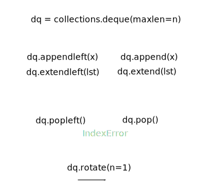

* this line gets replaced with the generated table of contents
{:toc}

# True, False, and comparisons

``` python
if () or [] or {} or None or 0 or '':
    'this line is skipped'
```

From <https://docs.python.org/3/library/stdtypes.html#truth-value-testing>:
> Considered false: instances with `__bool__()` returning False or `__len__()` returning zero. Built-ins:
> - `False`, `None`
> - zeroes of any numeric type: `0`, `0.0`, `Decimal(0)`, `Fraction(0, 1)`, `0j`
> - empty sequences and collections: `''`, `()`, `[]`, `{}`, `{}`, `set()`, `range(0)`

As in many languages, `and` and `or` are short-circuit operators, second argument is not evaluated here:
``` python
if False and whatever():
    'this line is skipped, whatever() is not evaluated'
```

Comparison operators look quite standard: `==`, `!=` (`<>` was removed from the language), `<`, `>`, `<=`, `>=`. And for object identity: `is`, `is not`.
> Behavior of the `is` and `is not` operators cannot be customized; also they can be applied to any two objects and never raise an exception.

Objects of different _built-in_ types never compare equal (except different numeric types), e.g., `'1' == 1` is false. `<`, `>`, `<=`, `>=` raise `TypeError` exception when the objects are of different types that cannot be compared.
``` python
>>> 'abc' > 1000
TypeError: unorderable types: str() > int()
```

`x < y < z` is equivalent to `x < y and y < z`, except `y` is evaluated only once. In both cases `z` is not evaluated at all when `x < y` is found to be false

Most importantly:

Use `if x`. Rarely `if x == True and type(x) is bool` when needed. Never `if x is True`, because `bool` is a subclass of `int`, this fails in obscure cases.

Same for `not x` and `False`.

An edge case is comparison to `None`. Use `if x is None`, never `x == None`. From [PEP 8](https://www.python.org/dev/peps/pep-0008/#programming-recommendations):
> Comparisons to singletons like None should always be done with is or is not , never the equality operators. 

Good:
```
if x:
  ...
if not x:
  ...
if x == True and type(x) is bool:
  ...
if x == False and type(x) is bool:
  ...
if x is None:
  ...
```

Bad:

```
if x is True:
  ...
if x is False:
  ...
if x == True:
  ...
if x == False:
  ...
if x == None:
  ...
```

There is a thing in python, operator chaining. It's for things like `x < y < z`, which is roughly equivalent to `x < y and y < z`. \\
Except `y` is evaluated only once here. \\
Btw, in both cases `z` is not evaluated at all when `x < y` is false. \\
Be careful, with operator chaining, `1 == 1 in [1]` is unreadable and it's not obvios that it's an operator chaining.

<iframe class="autoresize" src="{{ site.superlearn_url }}/ht/asdf2?deckname=python%20--%20true,%20false,%20and%20comparisons">
    <p>Your browser does not support iframes.</p>
</iframe>

TODO: `True + 1 == 2`, `False + 1 == 0`
TODO: <https://github.com/satwikkansal/wtfpython#-be-careful-with-chained-operations>

TODO: <http://canonical.org/~kragen/isinstance/>
<https://stackoverflow.com/questions/152580/whats-the-canonical-way-to-check-for-type-in-python>
- q: `type(s) is str` vs `type(s) == str` vs `isinstance(s, str)` -- a: Virtually no difference between `is` and `==` here, but people tend to use `is`. Type comparison answers the strict question: is this a type of object. `isinstance(o, cls)` considers type hierarcy.

<br />
<br />


# identity

<iframe class="autoresize" src="{{ site.superlearn_url }}/ht/asdf2?deckname=python%20--%20identity">
    <p>Your browser does not support iframes.</p>
</iframe>


# functions

<https://docs.python.org/3/tutorial/controlflow.html#more-on-defining-functions>

<http://effbot.org/zone/default-values.htm>
<https://stackoverflow.com/questions/1132941/least-astonishment-and-the-mutable-default-argument>
<https://stackoverflow.com/questions/291978/short-description-of-the-scoping-rules>

<https://docs.python.org/2/library/functions.html#apply>
Deprecated since version 2.3: Use function(*args, **keywords) instead of apply(function, args, keywords) (see Unpacking Argument Lists).

<http://effbot.org/zone/default-values.htm#valid-uses-for-mutable-defaults>


## mutable (default) argument

This is a design flaw, explicitly documented here: <https://docs.python.org/3/reference/compound_stmts.html#function-definitions>

> Default parameter values are evaluated from left to right when the function definition is executed.
> ...
> This is generally not what was intended.

The same effect can be easily achieved using let over lambda:

``` Python
def generate_f():
    default_mutable_argument = []
    def f(x, l = default_mutable_argument):
        l.append(x)
        return l
    return f

f = generate_f()
```

Python docs recommend this construct:

``` Python
def f(x, l = None):
    if l is None:
        l = []
    l.append(x)
    return l
```

Which can be enhanced slightly with type annotations for readability:

``` Python
def f(x, l: [] = None):
    ...
```

And doesn't mention this way at all:

``` Python
def f(a, L = []):
    L = copy(L)        # or deepcopy(L), or L[:], depending on context
    L.append(a)
    return L
```

Which is surprising to me. Because in this trivial example it makes sense, but here's another one:

``` Python
def f(a, L = None):
    if L is None:
        L = []
    L.append(a)
    return sum(L)/a
```

Here it really shouldn't modify the argument, but the mistake is obscure and can't be recognized.
TODO: a good real world example

In ruby it copies the default argument on every call and no puppy was harmed because of this.
 
<iframe class="autoresize" src="{{ site.superlearn_url }}/ht/asdf2?deckname=python%20--%20functions">
    <p>Your browser does not support iframes.</p>
</iframe>


## lambda

No return statement in lambdas: <https://docs.python.org/3/reference/expressions.html#lambda>

<https://stackoverflow.com/questions/862412/is-it-possible-to-have-multiple-statements-in-a-python-lambda-expression>
just use a tuple: `lambda x: ( f(x), g(x) )`

<iframe class="autoresize" src="{{ site.superlearn_url }}/ht/asdf2?deckname=python%20--%20lambda">
    <p>Your browser does not support iframes.</p>
</iframe>

# scope

Closures are good, for example, to have global scope clean, to replace hard-coded constants.

Python doesn't have open free variables: <http://effbot.org/zone/closure.htm>

```
def outer(msg):
    def inner():
        print(msg)
    return inner

i = outer('hell')
i()    # prints 'hell'
```

```
def closure():
    count = 0
    def inner():
        nonlocal count
        count += 1
        print(count)
    return inner
i = clojure()
i()    # prints 1
i()    # prints 2
i()    # prints 3
```

If you don't declare a var `global`, a new local one is created:

```
x = 0

def f():
    x = 1
    print(x)

f()     # 1
x       # 0
```

Global actually means module scope.

TODO: What is a closure?

LEGB rule: <https://stackoverflow.com/questions/291978/short-description-of-the-scoping-rules/292502#292502>


Instance and class variables can only be accessed by explicitly providing the namespace:

``` Python
class Foo():
    x = 0
    def foo(self):
        self.__class__.x = 1
        self.x = 10

ff = Foo()
ff.x == 0
ff.foo()
ff.x == 10
Foo.x == 1
```

The scope of names defined in a class block is limited to the class block; it does not extend to the code blocks of methods -– this includes comprehensions and generator expressions since they are implemented using a function scope:

``` Python
class Foo:
    x = 0
    def f(self):
        print(x)
        
Foo().f()     # NameError: name 'x' is not defined


class Foo:
    x = 0
    y = [x for _ in range(3)]     # NameError: name 'x' is not defined
```

<iframe class="autoresize" src="{{ site.superlearn_url }}/ht/asdf2?deckname=python%20--%20scope">
    <p>Your browser does not support iframes.</p>
</iframe>

# docstrings

PEP 257 -- Docstring Conventions: <https://www.python.org/dev/peps/pep-0257/>

<https://stackoverflow.com/questions/3898572/what-is-the-standard-python-docstring-format>

<iframe class="autoresize" src="{{ site.superlearn_url }}/ht/asdf2?deckname=python%20--%20docstrings">
    <p>Your browser does not support iframes.</p>
</iframe>


# conditionals and loops

``` Python
if False:
    whatever()
else:
    print('ok')
```

`switch/case` [pep-3103](https://www.python.org/dev/peps/pep-3103/)

``` Python
{
    'a': 1,
    'b': 2,
    'c': 3,
}.get(x, 0)
```
    
these do not support fall through, and this can be good or bad, depends on the point of view and problems you solve


`range()` used to be `xrange()` in python 2

``` Python
for n in range(0,100000000):
  pass

int i = 0
while i < 100000000:
  i += 1
```

<http://stackoverflow.com/questions/869229/why-is-looping-over-range-in-python-faster-than-using-a-while-loop>

``` Python
i = 100
for i in range(3):
    pass

print(i)    # prints 2
```

``` Python
i = 100
for i in []:
    pass

print(i)    # prints 100
```

<iframe class="autoresize" src="{{ site.superlearn_url }}/ht/asdf2?deckname=python%20--%20conditionals%20and%20loops">
    <p>Your browser does not support iframes.</p>
</iframe>

# ranges

<https://stackoverflow.com/questions/35004162/why-is-range0-range2-2-2-true-in-python-3>

<iframe class="autoresize" src="{{ site.superlearn_url }}/ht/asdf2?deckname=python%20--%20ranges">
    <p>Your browser does not support iframes.</p>
</iframe>

# comprehensions

``` python
[(x,y) for x in range(2) for y in range(3)]
```

<iframe class="autoresize" src="{{ site.superlearn_url }}/ht/asdf2?deckname=python%20--%20comprehensions">
    <p>Your browser does not support iframes.</p>
</iframe>


# input

`input()` used to be `raw_input()` in python 2: <http://www.diveintopython3.net/porting-code-to-python-3-with-2to3.html#raw_input>

``` python
int( input().strip() )
```

``` Python
while True:
    try:
        i = int(input('i: '))
        break
    except:
        pass

print(i)
```

<iframe class="autoresize" src="{{ site.superlearn_url }}/ht/asdf2?deckname=python%20--%20user%20input">
    <p>Your browser does not support iframes.</p>
</iframe>


# slicing

``` python
a = [0, 1, 2, 3, 4, 5, 6, 7]
b = ['a', 'b', 'c', 'd', 'e', 'f', 'g', 'h']
a[::2] = b[::2]
a == ['a', 1, 'c', 3, 'e', 5, 'g', 7]
```

Extended slices can't be used for assigning a list of different length: <https://docs.python.org/2.3/whatsnew/section-slices.html>

<iframe class="autoresize" src="{{ site.superlearn_url }}/ht/asdf2?deckname=python -- slicing">
    <p>Your browser does not support iframes.</p>
</iframe>


# shallow and deep copy

<http://www.python-course.eu/deep_copy.php>

q: What are shallow copy and deep copy? --- When you do `a = [1, 2, 3]; b = a`, you bind both variables to a list object. Now, if you operate on `a` and modify it, you modify the object, so you'll see changes through the `b` variable. If the list is flat, you can create a shallow copy, so different vars are bound to different list objects. But if a list contains other lists, a shallow copy is not enough, you need to create a deep copy. The same can be said about other mutable containers like dicts and sets.
q: Get a deep copy of a list, dict, set, deque. --- a: `copy.deepcopy(thing)`
q: What does `l = lst[:]` mean? --- a: Creates a shallow copy of entire list.

<iframe class="autoresize" src="{{ site.superlearn_url }}/ht/asdf2?deckname=python -- shallow and deep copy">
    <p>Your browser does not support iframes.</p>
</iframe>


# lists

``` python
lst = []
lst += 'a'
lst += ['b']
lst.append(['c'])
lst.insert(0, '0')
lst == ['0', 'a', 'b', ['c']]

lst == [3, 1, 2]
sorted(lst)
```

`lst.sort()` returns `None`, here is why: <https://mail.python.org/pipermail/python-dev/2003-October/038855.html>

pre-allocating a list benchmark: <http://stackoverflow.com/questions/22225666/pre-allocating-a-list-of-none>

`lst.index(e)` raises `ValueError` when `e` is not in the list, because a value like `-1` could lead to obscure bugs

Unpacking:

```
a, (b, c) = [1, [2, 3]]
a, b, *rest = range(10)
a, *rest, b = range(10)
first, *_, last = f.readlines()
```

Deleting has quircks too:

```
l = [0, 1, 2, 3, 4]
del l[10]           # IndexError
l[10:11] = []          # nothing happens
del l[10:11]           # same
```


<iframe class="autoresize" src="{{ site.superlearn_url }}/ht/asdf2?deckname=python -- lists">
    <p>Your browser does not support iframes.</p>
</iframe>


# tuples


<iframe class="autoresize" src="{{ site.superlearn_url }}/ht/asdf2?deckname=python -- tuples">
    <p>Your browser does not support iframes.</p>
</iframe>


# deques

<https://dbader.org/blog/queues-in-python>

{: .centered}



<iframe class="autoresize" src="{{ site.superlearn_url }}/ht/asdf2?deckname=python -- deques">
    <p>Your browser does not support iframes.</p>
</iframe>

# dicts

<https://docs.python.org/3/library/stdtypes.html#typesmapping>

interesting thing: `d[k]` raises `ValueError` when the `k` is not in the dict, while `d[k] = 'whatever'` sets the new value

``` python
d = {}
d[1]   # raises ValueError 
d[1] = 'whatever'   # sets the value
```

interesting: Due to the way the Python C-level APIs developed, a lot of built-in functions and methods don't actually have names for their arguments. `.get(x, default=0)` throws `TypeError: get() takes no keyword arguments`, but `.get(x, 0)` works

How (not) to merge dictionaries: <http://treyhunner.com/2016/02/how-to-merge-dictionaries-in-python/>, <https://stackoverflow.com/questions/38987/how-to-merge-two-dictionaries-in-a-single-expression/26853961#26853961>

TODO: `iteritems`, `iterkeys`, `itervalues` are no longer supported

TODO: how dicts are implemented: <https://stackoverflow.com/questions/327311/how-are-pythons-built-in-dictionaries-implemented/44509302#44509302>, <https://mail.python.org/pipermail/python-dev/2012-December/123028.html>

Why lists can't be keys in a dict: <https://wiki.python.org/moin/DictionaryKeys>


<iframe class="autoresize" src="{{ site.superlearn_url }}/ht/asdf2?deckname=python -- dictionaries">
    <p>Your browser does not support iframes.</p>
</iframe>


<iframe class="autoresize" src="{{ site.superlearn_url }}/ht/asdf2?deckname=python -- iterating over dictionaries">
    <p>Your browser does not support iframes.</p>
</iframe>


<https://stackoverflow.com/questions/2799064/how-do-i-merge-dictionaries-together-in-python>
<https://stackoverflow.com/questions/38987/how-to-merge-two-dictionaries-in-a-single-expression>

Dicts preserve order of insertion in python 3.7 and newer. <https://www.python.org/dev/peps/pep-0468/#motivation>

<https://github.com/mewwts/addict>

## setdefault and defaultdict

Good examples of `.setdefault()` <http://xwell.org/2015/04/07/python-tricks-setdefault/>:

``` Python
incident = {}
incident.setdefault('action', {}).setdefault('hacking', {}).setdefault('variety', []).append("Brute force")   # => {'action': {'hacking': {'variety': ['Brute force']}}}
```

<https://github.com/mewwts/addict>: for working with dicts js-style:

```
mapping = addict.Dict()
mapping.a.b.c.d.e = 2
mapping == {'a': {'b': {'c': {'d': {'e': 2}}}}}
```

<https://code.activestate.com/recipes/66516-add-an-entry-to-a-dictionary-unless-the-entry-is-a/>:

> setdefault is normally not useful if the values are immutable
> setdefault is particularly useful for the very common data structure that is a dictionary whose values are lists, and the single most typical usage form for it is somedict.setdefault(somekey,[]).append(somevalue).

<http://python.net/~goodger/projects/pycon/2007/idiomatic/handout.html>:

> The only problem with dict.setdefault() is that the default value is always evaluated, whether needed or not. That only matters if the default value is expensive to compute.

<http://python.net/~goodger/projects/pycon/2007/idiomatic/handout.html>:

> You cannot get KeyError exceptions from properly initialized defaultdict instances. You have to use a "key in dict" conditional if you need to check for the existence of a specific key.


## OrderedDict

<https://www.reddit.com/r/Python/comments/7jyluw/dict_knownordered_versus_ordereddict_an/>

<https://docs.python.org/3/library/collections.html#collections.OrderedDict>

TODO: performance comparison `dict` vs `collections.OrderedDict` 

<iframe class="autoresize" src="{{ site.superlearn_url }}/ht/asdf2?deckname=python -- collections.OrderedDict">
    <p>Your browser does not support iframes.</p>
</iframe>


# sets

`isdisjoint` is faster than `s & t`, because it does short-circuit: <https://stackoverflow.com/questions/45112928/python-isdisjoint-runtime>

<iframe class="autoresize" src="{{ site.superlearn_url }}/ht/asdf2?deckname=python -- sets">
    <p>Your browser does not support iframes.</p>
</iframe>


# itertools module

Summary table: <https://docs.python.org/3/library/itertools.html>

<https://more-itertools.readthedocs.io/en/latest/>, <https://github.com/erikrose/more-itertools>

```
lst = [('USA', 'LA'), ('Russia', 'Moscow'), ('USA', 'NY'), ('Russia', 'St. Petersburg'), ('England', 'London')]

[(k, list(g)) 
   for k, g in 
   itertools.groupby( sorted(lst), key = lambda x: x[0] )]
             ## [('England', [('England', 'London')]), ('Russia', [('Russia', 'Moscow'), ('Russia', 'St. Petersburg')]), ('USA', [('USA', 'LA'), ('USA', 'NY')])]

[(k, [j for i,j in g]) 
   for k, g in 
   itertools.groupby( sorted(lst), key = lambda x: x[0] )]
             ## [('England', ['London']), ('Russia', ['Moscow', 'St. Petersburg']), ('USA', ['LA', 'NY'])]
```

TODO: how to get prev and next values in a loop
if you don't have to look too smart:


```
l = len(timestamps)
for i in range(l):
    if i < l-1:
        result.append(timestamps[i])
        result.append(  (timestamps[i] + timestamps[i+1]) / 2  )
    else:
        result.append(timestamps[i])
```

q: divide a string into groups of repeated consecutive elements, e.g., `'AAAABBBCCDAA'` into `['AAAA', 'BBB', 'CC', 'D', 'AA']` --- a: `[''.join(list(g)) for k, g in itertools.groupby('AAAABBBCCDAA')]`
q: group elements of a list by some key, e.g., `[..., ('Russia', 'Moscow'), ..., ('Russia', 'St. Petersburg'), ...]` into  `[..., ('Russia', ['Moscow', 'St. Petersburg']), ...]`--- a: `[(k, [j for i,j in g]) for k, g in itertools.groupby(sorted(lst), lambda x: x[0])]`


<iframe class="autoresize" src="{{ site.superlearn_url }}/ht/asdf2?deckname=python -- itertools">
    <p>Your browser does not support iframes.</p>
</iframe>


