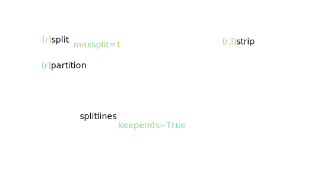

* this line gets replaced with the generated table of contents
{:toc}


# strings

TODO: unicode
TODO: `str(bytes, encoding, errors)` is equivalent to `bytes.decode(encoding, errors)`
TODO: `str.encode(encoding="utf-8", errors="strict")`
TODO: `io.StringIO`, `io.BytesIO`, `tempfile.SpooledTemporaryFile`

TODO: <https://docs.python.org/3/library/string.html#string-constants>

<https://stackoverflow.com/questions/40348174/should-i-use-python-casefold>


<https://stackoverflow.com/questions/34546171/python-expandtabs-string-operation>

{: .centered}


<iframe class="autoresize" src="{{ site.superlearn_url }}/ht/asdf2?deckname=python -- strings">
    <p>Your browser does not support iframes.</p>
</iframe>


## concatenation

Strings `.join()` vs `+=` in a loop: <http://stackoverflow.com/questions/1349311/python-string-join-is-faster-than-but-whats-wrong-here/21964653#21964653>

Strings are immutable, we can't use these operations on them: <https://docs.python.org/3/library/stdtypes.html#typesseq-mutable>

<iframe class="autoresize" src="{{ site.superlearn_url }}/ht/asdf2?deckname=python -- strings concatenation">
    <p>Your browser does not support iframes.</p>
</iframe>

## substrings

<iframe class="autoresize" src="{{ site.superlearn_url }}/ht/asdf2?deckname=python -- strings substrings">
    <p>Your browser does not support iframes.</p>
</iframe>

## reverse

<iframe class="autoresize" src="{{ site.superlearn_url }}/ht/asdf2?deckname=python -- strings reverse">
    <p>Your browser does not support iframes.</p>
</iframe>

Be careful with the `sep` argument of `a_str.split()`: if a `sep` arg is not specified or `None`, an empty string is split into an empty list: `''.split() == []`; otherwise: `''.split(',') ==['']`.
When it's not actually split: returns a list containing the string. `'  a  '.split(',') == ['  a  ']`; if a `sep` arg is not specified or `None`, it also trims it: `'  a  '.split() == ['a']`

## split and strip

<https://docs.python.org/3/library/stdtypes.html#str.split>, <https://stackoverflow.com/questions/16645083/when-splitting-an-empty-string-in-python-why-does-split-return-an-empty-list>

It's not immediately obvious that the `str.split(sep=None, maxsplit=-1)` function has two algorithms under the hood.

With no arguments (or `sep=None`) the runs of consecutive whitespace are regarded as a single separator. This is useful when data is given in columns:

```
'a       b   c'.split() == ['a', 'b', 'c']
```

If a `sep` is given, it doesn't group delimiters. This is useful for data separated by commas: 

```
'a,b,c'.split(',') == ['a', 'b', 'c']
```

The non-obvious thing about this function is that `''.split() != ''.split(' ')`.

This is because when there's no `sep` the number of result fields is _one less_ than the number of actual delimiters: `' a '` has two delimiters and splitting it will result in one field. `'a'` too by the way, empty whitespace is still a whitespace for this algorithm.

And with `sep` given the number of result fields is _one more_ than the number of actual delimiters: `','` has one delimiter and splitting will result in two fields.

So the edge case when the string is empty works like this: `''.split()` will have zero fields because the number of delimiters is one, while `''.split(' ')` will have one field because the number of delimiters is zero.

`˽1˽2˽` — one less fields, `1,2` — one more fields.

{: .centered}


<iframe class="autoresize" src="{{ site.superlearn_url }}/ht/asdf2?deckname=python -- strings split and trim">
    <p>Your browser does not support iframes.</p>
</iframe>

## alignment

{: .centered}


``` python
>>> '{:<30}'.format('left aligned')
'left aligned                  '
>>> '{:>30}'.format('right aligned')
'                 right aligned'
>>> '{:^30}'.format('centered')
'           centered           '
>>> '{:*^30}'.format('centered')  # use '*' as a fill char
'***********centered***********'
```

We can also print numbers like `+00042`, there is another align option besides `<`, `>`, `^`, it's `=`:

``` python
'{:0=6}'.format(   42)   == '000042'
'{:0=6}'.format(  -42)   == '-00042'
'{:0=+6}'.format(  42)   == '+00042'
'{:0=+6}'.format( -42)   == '-00042'
'{:0=-6}'.format(  42)   == '000042'
'{:0=-6}'.format( -42)   == '-00042'
'{:0= 6}'.format(  42)   == ' 00042'
'{:0= 6}'.format( -42)   == '-00042'
# there is old `'42'.zfill(6)`, but format is far better
```

<iframe class="autoresize" src="{{ site.superlearn_url }}/ht/asdf2?deckname=python -- strings adjustments">
    <p>Your browser does not support iframes.</p>
</iframe>


## checks

<iframe class="autoresize" src="{{ site.superlearn_url }}/ht/asdf2?deckname=python -- strings other">
    <p>Your browser does not support iframes.</p>
</iframe>


# f-strings

<https://www.python.org/dev/peps/pep-0498/#expression-evaluation>:

> The expressions that are extracted from the string are evaluated in the context where the f-string appeared. This means the expression has full access to local and global variables. Any valid Python expression can be used, including function and method calls.

Gotcha: we can't have `'\n'` in a expression part of an f-string, e.g.: `f"{'\n'.join(l)}"` won't work.

Our choises are:

- have it joined outside: `s = '\n'.join(l); f"{s}"`
- `newline = '\n'; f'{newline.join(l)}'`
- `'{}'.format('\n'.join(l))`
- `print(*l, sep='\n')`

<https://docs.python.org/3/reference/lexical_analysis.html#f-strings>

<iframe class="autoresize" src="{{ site.superlearn_url }}/ht/asdf2?deckname=python -- strings f-strings">
    <p>Your browser does not support iframes.</p>
</iframe>


# format

<https://docs.python.org/3/library/string.html#format-specification-mini-language>

``` Text
format_spec     ::=  [[fill]align][sign][#][0][width][grouping_option][.precision][type]
fill            ::=  <any character>
align           ::=  "<" | ">" | "=" | "^"
sign            ::=  "+" | "-" | " "
width           ::=  integer
grouping_option ::=  "_" | ","
precision       ::=  integer
type            ::=  "b" | "c" | "d" | "e" | "E" | "f" | "F" | "g" | "G" | "n" | "o" | "s" | "x" | "X" | "%"
```

``` python
'hello, {}'.format(username)

'{1} is better than {0}, {2}{2}'.format('emacs', 'vim', 'ha')
'{0} {2} {1} {2}'.format(*tpl)

'{0!s}'.format(an_obj)   # calls str() on the argument
'{0!r}'.format(an_obj)   # calls repr() on the argument
'{0!a}'.format(an_obj)   # calls ascii() on the argument
'repr() shows quotes: {0!r}; str() doesn't: {0!s}'.format('test')

'{first} {last}'.format(first='John', last='Smith')
'{first} {last}'.format(**{'first': 'John', 'last': 'Smith'})

'{0.real}, {0.imag}'.format(1-1j)

coord = (3, 5)
'X: {0[0]};  Y: {0[1]}'.format(coord)


'{:f}'.format(1) == '1.000000'
'{:.1f} {}'.format(698.243, 'GB') == '698.2 GB'
'{0} {0:g}'.format(1.0)

'{:+f}; {:+f}'.format(3.14, -3.14) == '+3.140000; -3.140000'   # always show sign
'{: f}; {: f}'.format(3.14, -3.14) == ' 3.140000; -3.140000'

'{:-f}; {:-f}'.format(3.14, -3.14)    # default, same as just {:f}

'{:#5x}'.format(15) == '  0xf'
'{:#5X}'.format(15) == '  0XF'

map('%Y-%m-%d'.format, lst)
```

``` python
import locale
locale.setlocale(locale.LC_ALL, 'en_US')   ## in this example we set a locale to see the difference:
'{:n}'.format(10**6) == '1,000,000'
locale.setlocale(locale.LC_ALL, locale.getdefaultlocale())

'{:.1%}'.format(0.33) == '33.0%'
'{:.3s}'.format('xylophone') == 'xyl'

'{:{fill}{align}{width}}'.format('hello', fill='*', align='^', width=11) == '***hello***'
```

for formatting dates see the dates section

not covered: printing binary and octal

<iframe class="autoresize" src="{{ site.superlearn_url }}/ht/asdf2?deckname=python -- strings format">
    <p>Your browser does not support iframes.</p>
</iframe>


## format numbers

There are also `'{:n}'` and `'{:e}'`.

<iframe class="autoresize" src="{{ site.superlearn_url }}/ht/asdf2?deckname=python -- strings format numbers">
    <p>Your browser does not support iframes.</p>
</iframe>


# print()

Here are the defaults: `print(*objects, sep=' ', end='\n', file=sys.stdout, flush=False)`.

{: .centered}


Be careful with `stderr`, you have to flush it[^1]:

[^1]: https://stackoverflow.com/questions/939866/print-vs-stderr/2411107#2411107

```
for n in range(3):
    print(n, file=sys.stderr, end='')    # print n to sys.stderr with no newline char
    time.sleep(1)
```
 

<iframe class="autoresize" src="{{ site.superlearn_url }}/ht/asdf2?deckname=python -- strings print">
    <p>Your browser does not support iframes.</p>
</iframe>


